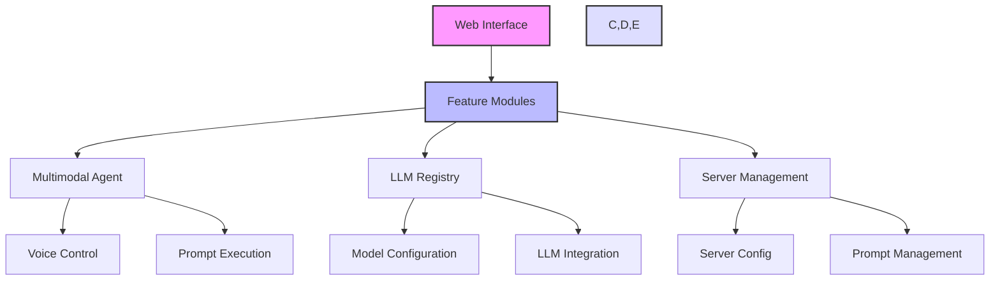

# Systemprompt MCP Client

[](https://www.npmjs.com/package/systemprompt-agent-server)
[](https://smithery.ai/server/multimodal-mcp-client)
[](https://opensource.org/licenses/MIT)
[](https://twitter.com/tyingshoelaces_)
[](https://discord.com/invite/wkAbSuPWpr)

[Website](https://systemprompt.io) | [Documentation](https://systemprompt.io/documentation) | [Blog](https://tyingshoelaces.com) | [Get API Key](https://systemprompt.io/console)

> 🌟 **Free and Open Source Software**: A modern voice-controlled AI interface powered by Google Gemini and MCP (Model Control Protocol). Transform how you interact with AI through natural speech and multimodal inputs.

A modern Vite + TypeScript application that enables voice-controlled AI workflows through MCP (Model Control Protocol). This project revolutionizes how you interact with AI systems by combining Google Gemini's multimodal capabilities with MCP's extensible tooling system.

## 🎯� Why Systemprompt MCP?

Transform your AI interactions with a powerful voice-first interface that combines the best of:

- **Google Gemini's Multimodal AI**: Understand and process text, voice, and visual inputs naturally
- **MCP (Model Control Protocol)**: Execute complex AI workflows with a robust tooling system
- **Voice-First Design**: Control everything through natural speech, making AI interaction more intuitive

Perfect for:

- **Developers** building voice-controlled AI applications
- **Teams** needing a flexible AI workflow orchestration system
- **Organizations** wanting to leverage Google Gemini's capabilities with extensible tooling

## 🎯 Core Features

### Voice & Multimodal Intelligence

- **Natural Voice Control**: Speak naturally to control AI workflows and execute commands
- **Multimodal Understanding**: Process text, voice, and visual inputs simultaneously
- **Real-time Voice Synthesis**: Get instant audio responses from your AI interactions

### AI Workflow Orchestration

- **Extensible Tool System**: Add custom tools and workflows through MCP
- **Workflow Automation**: Chain multiple AI operations with voice commands
- **State Management**: Robust handling of complex, multi-step AI interactions

### Developer Experience

- **Modern Tech Stack**: Built with Vite, React, TypeScript, and NextUI
- **Type Safety**: Full TypeScript support with comprehensive type definitions
- **Hot Module Replacement**: Fast development with instant feedback
- **Comprehensive Testing**: Built-in testing infrastructure with high coverage

### Enterprise Ready

- **Secure**: Built-in security best practices for API key management
- **Scalable**: Modular architecture supporting multiple LLM providers
- **Configurable**: Extensive configuration options for different environments

## 🏗️ Architecture

The system follows a modular, feature-based architecture:



### Key Components

- **Multimodal Agent**: Handles voice recognition, synthesis, and multimodal processing
- **LLM Registry**: Manages different language models and their configurations
- **Server Management**: Handles MCP server connections and tool orchestration
- **Voice Control**: Processes natural language commands and converts them to actions
- **Prompt Management**: Handles system prompts and their execution

## 🚀 Getting Started

### Prerequisites

- Node.js 16.x or higher
- npm 7.x or higher
- A modern browser with Web Speech API support

### Development Setup

1. Clone the repository:

   ```bash
   git clone https://github.com/Ejb503/systemprompt-mcp-client.git
   cd systemprompt-mcp-client
   ```

2. Install dependencies:

   ```bash
   npm install
   ```

3. Set up configuration files:

   ```bash
   # Navigate to config directory
   cd config

   # Create local configuration files from templates
   cp mcp.config.default.json mcp.config.json
   cp agent.config.default.json agent.config.json
   cp llm.config.default.json llm.config.json
   ```

   Edit the created files to add your specific settings:

   - `mcp.config.json`: Configure MCP server connections
   - `agent.config.json`: Set up agent configurations
   - `llm.config.json`: Configure LLM settings and API keys

   Optional: You can get a free API key from [systemprompt.io/console](https://systemprompt.io/console) or configure any custom MCP server of your choice in `mcp.config.json`.

4. Start the development server:

   ```bash
   npm run dev
   ```

   The development server will be available at `http://localhost:5173`

5. Build for production:
   ```bash
   npm run build
   npm run preview  # Preview the production build locally
   ```

## 🛠️ Tech Stack

- **Frontend**: React 18, TypeScript, Vite 6
- **UI Components**: NextUI, Tailwind CSS, Framer Motion
- **State Management**: Zustand
- **Testing**: Vitest, Testing Library
- **AI Integration**: Google Generative AI SDK
- **MCP Protocol**: @modelcontextprotocol/sdk
- **Development**: ESLint, TypeScript 5.6

## 📦 Key Features

### 🎙️ Voice Control System

- Natural language command processing
- Real-time voice synthesis
- Multi-language support
- Voice activity detection

### 🤖 AI Integration

- Google Gemini integration
- Multimodal input processing
- Real-time AI responses
- Custom prompt management

### 🔧 MCP Tools

- SSE and stdio server support
- Custom tool creation
- Workflow automation
- State persistence

### 💼 Enterprise Features

- Secure API key management
- Multiple server configurations
- Extensible architecture
- Comprehensive logging

## 🧪 Testing & Quality

```bash
# Run tests
npm test

# Watch mode
npm run test:watch

# Coverage report
npm run test:coverage
```

## 📈 Version History

- **v0.3.6** - Current release
  - Enhanced voice processing
  - Updated to Vite 6
  - Improved TypeScript support
  - New UI components

## 🤝 Contributing

We welcome contributions! See our [Contributing Guide](CONTRIBUTING.md) for details.

## 🔐 Security

- Secure API key handling
- Environment-based configuration
- Regular security updates
- Protected server endpoints

## 📞 Support

- [Discord Community](https://discord.com/invite/wkAbSuPWpr)
- [GitHub Issues](https://github.com/Ejb503/multimodal-mcp-client/issues)
- [Documentation](https://systemprompt.io/documentation)
- Email: support@systemprompt.io

## 📄 License

This project is licensed under the MIT License - see the [LICENSE](LICENSE) file for details.

## 🙏 Acknowledgments

- Google Gemini team for their powerful multimodal AI capabilities
- Model Control Protocol (MCP) community
- React and TypeScript communities
- NextUI and Tailwind CSS teams
- All contributors and maintainers

## 🔗 Resources

- [Tailwind CSS Documentation](https://tailwindcss.com/docs)
- [NextUI Components](https://nextui.org)
- [React TypeScript Guidelines](https://react-typescript-cheatsheet.netlify.app/)
- [ARIA Practices Guide](https://www.w3.org/WAI/ARIA/apg/)

## 💪 Sponsored by Systemprompt

This project is proudly sponsored and maintained by [Systemprompt](https://systemprompt.io). We're committed to advancing the field of AI tooling and making powerful AI interfaces accessible to everyone.

### 🚀 Extensions in Development

We're actively working on expanding the capabilities of Systemprompt MCP Client with exciting extensions:

- **Custom Tool Builder**: Create and deploy your own MCP tools
- **Enterprise Workflow Templates**: Pre-built workflows for common business scenarios
- **Advanced Voice Processing**: Enhanced voice recognition and synthesis capabilities
- **Team Collaboration Features**: Multi-user support and shared workflows

Stay tuned for updates and new releases! Follow us on [GitHub](https://github.com/Ejb503/multimodal-mcp-client) or join our [Discord community](https://discord.com/invite/wkAbSuPWpr) for the latest news.
