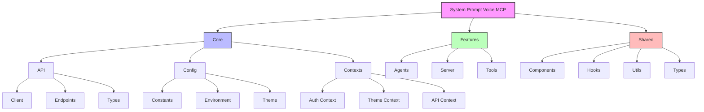
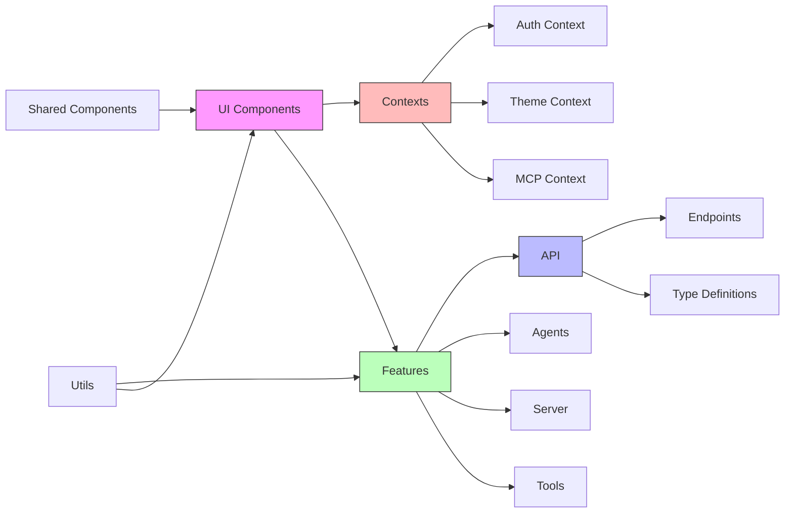
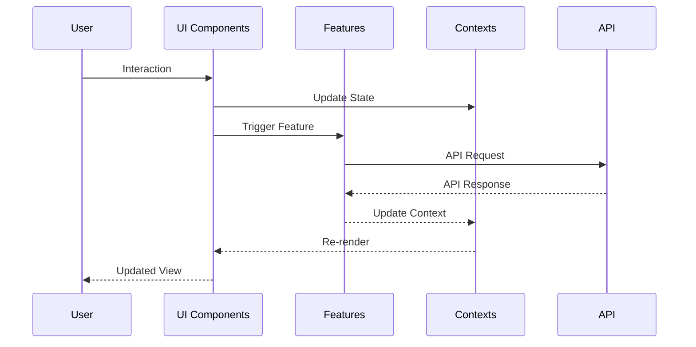

# System Prompt Voice MCP - Architecture

## Application Structure

```mermaid
graph TD
    A[System Prompt Voice MCP] --> B[Core]
    A --> C[Features]
    A --> D[Shared]

    %% Core Module
    B --> B1[API]
    B --> B2[Config]
    B --> B3[Contexts]
    B1 --> B1a[Client]
    B1 --> B1b[Endpoints]
    B1 --> B1c[Types]
    B2 --> B2a[Constants]
    B2 --> B2b[Environment]
    B2 --> B2c[Theme]
    B3 --> B3a[Auth Context]
    B3 --> B3b[Theme Context]
    B3 --> B3c[API Context]

    %% Features Module
    C --> C1[Agents]
    C --> C2[Server]
    C --> C3[Tools]

    %% Shared Module
    D --> D1[Components]
    D --> D2[Hooks]
    D --> D3[Utils]
    D --> D4[Types]

    %% Styling
    style A fill:#f9f,stroke:#333,stroke-width:2px
    style B fill:#bbf,stroke:#333
    style C fill:#bfb,stroke:#333
    style D fill:#fbb,stroke:#333
```

## Component Relationships

```mermaid
flowchart LR
    %% Main Components
    UI[UI Components] --> Contexts
    UI --> Features
    Features --> API

    %% Context Flow
    Contexts --> Auth[Auth Context]
    Contexts --> Theme[Theme Context]
    Contexts --> MCP[MCP Context]

    %% Feature Integration
    Features --> Agents
    Features --> Server
    Features --> Tools

    %% API Integration
    API --> Endpoints
    API --> TypeDefs[Type Definitions]

    %% Shared Resources
    SharedComponents[Shared Components] --> UI
    Utils --> Features
    Utils --> UI

    %% Styling
    style UI fill:#f9f,stroke:#333
    style Features fill:#bfb,stroke:#333
    style API fill:#bbf,stroke:#333
    style Contexts fill:#fbb,stroke:#333
```

## Data Flow

```mermaid
sequenceDiagram
    participant U as User
    participant UI as UI Components
    participant F as Features
    participant C as Contexts
    participant A as API

    U->>UI: Interaction
    UI->>C: Update State
    UI->>F: Trigger Feature
    F->>A: API Request
    A-->>F: API Response
    F-->>C: Update Context
    C-->>UI: Re-render
    UI-->>U: Updated View
```
