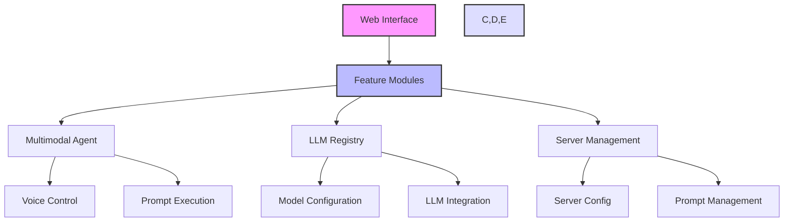
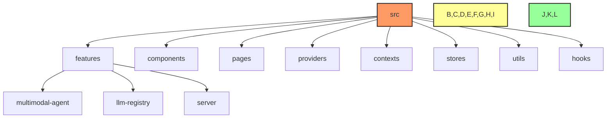

# Systemprompt MCP Client

A modern Vite + TypeScript application that enables voice-controlled AI workflows through MCP (Model Control Protocol). This project revolutionizes how you interact with AI systems by combining Google Gemini's multimodal capabilities with MCP's extensible tooling system.

## 🎤 What is Systemprompt MCP?

Systemprompt MCP Client is a powerful interface that combines:

- Google Gemini's advanced multimodal AI capabilities for understanding voice and visual inputs
- MCP (Model Control Protocol) for extensible tool integration and AI workflow orchestration
- Voice-controlled interface for natural interaction with AI systems

The system enables you to:

- Control AI workflows through natural voice commands
- Leverage Google Gemini for sophisticated multimodal understanding
- Execute complex system prompts using voice input
- Extend functionality through MCP's tool system
- Manage and monitor AI operations through a modern web interface

Think of it as a voice-enabled AI control center - you speak, Gemini understands your intent across multiple modalities, and MCP orchestrates the appropriate tools and workflows to accomplish your goals.

## 🎯 Purpose

The Systemprompt MCP Client serves as a central control panel for:

- Voice-controlled AI workflow orchestration through MCP's tool system
- Multimodal interactions powered by Google Gemini
- Managing and executing system prompts with voice commands
- Configuring and interacting with multiple LLM models
- Providing an extensible interface for AI interactions
- Streamlining server-side configurations and prompt management

## 🏗️ Architecture Overview



### Project Structure



## 📁 Directory Structure

```
src/
├── features/           # Core feature modules
│   ├── multimodal-agent/   # Voice and multimodal interactions
│   ├── llm-registry/      # LLM configuration and management
│   └── server/           # Server-side features and config
├── components/         # Shared UI components
├── pages/             # Application pages/routes
├── providers/         # React providers
├── contexts/          # Application contexts
├── stores/            # State management
├── utils/             # Utility functions
├── hooks/             # Custom React hooks
└── test/              # Test utilities and setup
```

## 🚀 Getting Started

### Prerequisites

- Node.js 16.x or higher
- npm 7.x or higher
- A modern browser with Web Speech API support

### Development Setup

1. Install dependencies:

   ```bash
   npm install
   ```

2. Configure environment variables:

   - Copy `.env.example` to `.env`
   - Set up required API keys and configurations:
     ```env
     VITE_API_KEY=your_api_key
     VITE_MCP_ENDPOINT=your_mcp_endpoint
     ```

3. Start the development server:

   ```bash
   npm run dev
   ```

   This will start the Vite development server with HMR (Hot Module Replacement)

4. Build for production:
   ```bash
   npm run build
   npm run preview  # Preview the production build locally
   ```

The development server will be available at `http://localhost:5173` by default.

## 📄 Configuration

The application uses several configuration files in the `config/` directory:

- `mcp.config.json`: Main configuration for the MCP tool system
- `voice-config.json`: Voice recognition and synthesis settings
- `llm.config.json`: Gemini and other LLM model configurations
- `server.config.ts`: Server-side settings

## 🧪 Testing

We maintain comprehensive test coverage:

```bash
# Run all tests
npm test

# Run tests with coverage
npm run test:coverage
```

## 🤝 Contributing

1. Fork the repository
2. Create a feature branch (`git checkout -b feature/amazing-feature`)
3. Commit your changes (`git commit -m 'Add amazing feature'`)
4. Push to the branch (`git push origin feature/amazing-feature`)
5. Open a Pull Request

### Development Guidelines

1. **Code Style**

   - Use TypeScript for all new code
   - Follow the existing code style and conventions
   - Document all new features and changes

2. **Testing**

   - Write unit tests for new features
   - Maintain or improve code coverage
   - Test across different environments

3. **Documentation**
   - Update README.md for significant changes
   - Document new features in relevant feature folders
   - Keep API documentation up to date

## 📄 License

This project is licensed under the MIT License - see the LICENSE file for details.

## 🙏 Acknowledgments

- Google Gemini team
- Model Control Protocol (MCP) community
- React and TypeScript communities
- Contributors and maintainers
- Open source projects that made this possible
