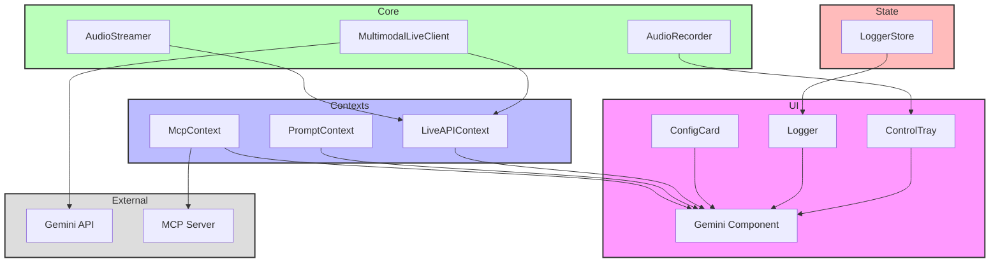

# Multimodal Agent Feature

## Overview

The Multimodal Agent is a sophisticated React-based feature that enables real-time interaction with AI models through multiple modalities including text, audio, and potentially images. It integrates with Google's Generative AI services and supports extensible tool-based interactions through a Model Context Protocol (MCP).

## Directory Structure

```
multimodal-agent/
├── __llm__/                # LLM-specific documentation
│   ├── README.md           # This file
│   └── architecture.md     # Detailed architecture docs
├── components/             # UI components
│   ├── Gemini/            # Main Gemini component
│   ├── ControlTray/       # Audio controls
│   ├── Logger/            # Activity logger
│   └── ConfigCard/        # Configuration UI
├── contexts/              # React contexts
│   ├── LiveAPIContext/    # Gemini API context
│   ├── PromptContext/     # Prompt management
│   └── McpContext/        # MCP integration
├── hooks/                 # Custom hooks
│   ├── useAudioRecorder/  # Audio recording
│   └── useMultimodal/     # Core functionality
└── utils/                 # Utility functions
    ├── audio/            # Audio processing
    └── tools/            # Tool definitions
```

## Architecture



## Implementation Standards

### 1. Component Guidelines

```typescript
// Example component structure
export interface GeminiProps {
  config: LiveConfig;
  onStateChange?: (state: GeminiState) => void;
}

export const Gemini: React.FC<GeminiProps> = ({ config, onStateChange }) => {
  // Implementation
};
```

#### Standards:

- Use TypeScript for all components
- Implement proper prop types and defaults
- Follow accessibility guidelines (WCAG 2.1)
- Use error boundaries for component isolation
- Implement proper loading states
- Handle edge cases gracefully

### 2. Context Management

```typescript
// Example context implementation
export interface LiveAPIContextValue {
  client: MultimodalLiveClient | null;
  connect: () => Promise<void>;
  disconnect: () => void;
  state: ConnectionState;
}

export const LiveAPIContext = createContext<LiveAPIContextValue>(null!);

export function LiveAPIProvider({ children }: PropsWithChildren) {
  // Implementation
}
```

#### Standards:

- Provide proper TypeScript types
- Implement proper error handling
- Use proper context initialization
- Handle cleanup properly
- Document context values and methods

### 3. Hook Development

```typescript
// Example hook implementation
export function useAudioRecorder(config: AudioConfig) {
  const [state, setState] = useState<RecorderState>("inactive");

  useEffect(() => {
    // Cleanup logic
    return () => {
      // Cleanup implementation
    };
  }, []);

  // Implementation
}
```

#### Standards:

- Follow React hooks rules
- Implement proper cleanup
- Handle errors gracefully
- Use proper TypeScript types
- Document hook usage and return values

### 4. Testing Requirements

#### Unit Tests

- Components: 80% coverage
- Hooks: 90% coverage
- Utils: 90% coverage

```typescript
// Example test structure
describe("Gemini Component", () => {
  it("should initialize with default state", () => {
    // Test implementation
  });

  it("should handle audio recording", () => {
    // Test implementation
  });
});
```

### 5. Performance Guidelines

- Use React.memo for expensive renders
- Implement proper dependencies in useEffect
- Use proper data structures for state
- Implement proper error boundaries
- Profile and optimize render cycles

## Configuration

### Environment Variables

```env
VITE_GEMINI_API_KEY=your_api_key
VITE_MCP_SERVER_URL=ws://localhost:3000
VITE_AUDIO_SAMPLE_RATE=16000
```

### LiveConfig Interface

```typescript
interface LiveConfig {
  model: string;
  systemInstructions?: string;
  generation: {
    temperature: number;
    topP: number;
    topK: number;
  };
  tools?: ToolConfig[];
  voice?: VoiceConfig;
}
```

## Development Process

1. **Setup**

   ```bash
   npm install
   cp .env.example .env
   # Configure environment variables
   npm run dev
   ```

2. **Testing**

   ```bash
   npm run test
   npm run test:coverage
   ```

3. **Building**
   ```bash
   npm run build
   ```

## Best Practices

1. **State Management**

   - Use contexts for global state
   - Use local state for UI
   - Implement proper state updates
   - Handle side effects properly

2. **Error Handling**

   - Implement proper error boundaries
   - Log errors appropriately
   - Provide user feedback
   - Handle edge cases

3. **Performance**

   - Optimize render cycles
   - Use proper memoization
   - Implement lazy loading
   - Profile and optimize

4. **Security**
   - Validate user input
   - Sanitize data
   - Handle API keys securely
   - Implement proper CORS
