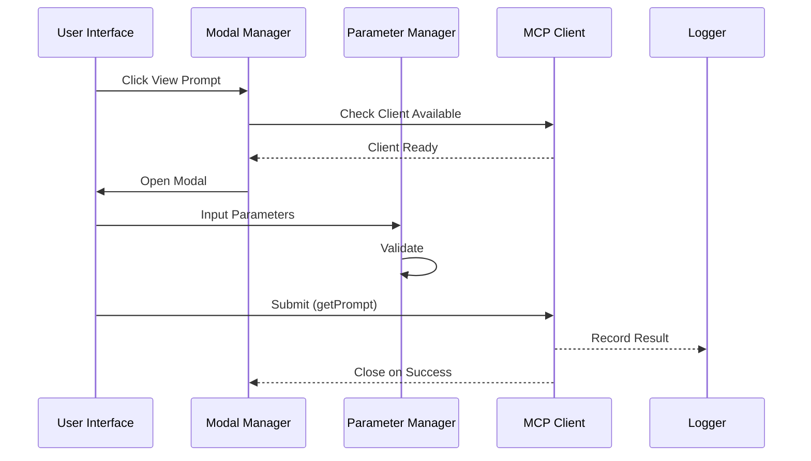
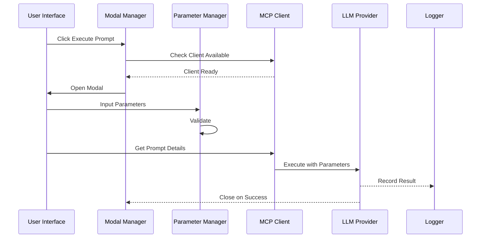
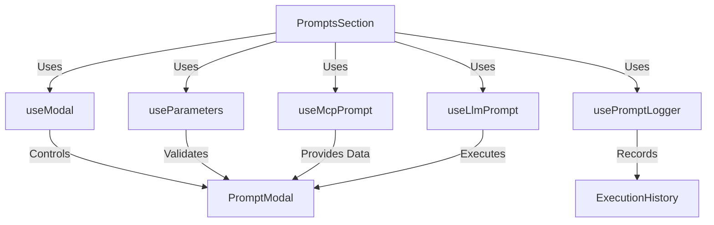

# Server Features

## File Structure

```
📁 server/
├── 📁 __llm__/
│   └── 📄 README.md
├── 📁 components/
│   ├── 📄 PromptsSection.tsx
│   └── 📄 PromptModal.tsx
├── 📁 hooks/
│   ├── 📄 useModal.ts
│   ├── 📄 useParameters.ts
│   ├── 📄 useMcpPrompt.ts
│   ├── 📄 useLlmPrompt.ts
│   ├── 📄 usePromptLogger.ts
│   ├── 📄 usePromptExecution.ts
│   └── 📄 useServer.ts
└── 📁 utils/
    └── 📄 validation.ts
```

## Core Concepts

### Hooks Architecture

1. `useModal` - Modal State Management

   - Opens/closes modal
   - Manages modal mode (view/execute)
   - Handles modal actions

2. `useParameters` - Parameter Management

   - Manages parameter values
   - Handles validation
   - Provides parameter update methods

3. `useMcpPrompt` - MCP Operations

   - Handles MCP client availability
   - Fetches prompt details
   - Executes MCP operations
   - Manages connection status (connected/pending/disconnected)

4. `useLlmPrompt` - LLM Operations

   - Manages LLM provider
   - Executes prompts via LLM
   - Handles LLM responses
   - Validates message availability

5. `usePromptLogger` - Logging

   - Records operations
   - Manages execution history
   - Provides logging utilities
   - Supports success/error logging

6. `usePromptExecution` - Prompt Execution Management

   - Manages prompt selection state
   - Handles parameter validation
   - Controls execution flow
   - Provides error handling

7. `useServer` - Server Management
   - Manages server connection state
   - Handles server capabilities
   - Provides unified server interface
   - Manages prompt and resource operations

### Flow Diagrams

#### View Prompt Flow



#### Execute Prompt Flow



### Component Integration



## Implementation Details

### State Management

Each hook maintains its own isolated state:

- Modal: `isOpen`, `mode`
- Parameters: `values`, `errors`
- MCP: `client`, `status`
- LLM: `provider`, `status`
- Logger: `history`, `operations`

### Error Handling

1. Client Availability

   ```typescript
   if (!clientState?.client) {
     throw new Error("No MCP client available");
   }
   ```

2. Parameter Validation

   ```typescript
   const errors: ValidationError[] = [];
   if (!selectedPrompt?.inputSchema) return errors;

   const { required = [] } = selectedPrompt.inputSchema;
   required.forEach((key) => {
     if (!promptParams[key] || promptParams[key].trim() === "") {
       errors.push({
         path: [key],
         message: `${key} is required`,
       });
     }
   });
   ```

3. Operation Results
   ```typescript
   try {
     const result = await onExecutePrompt(selectedPrompt.name, promptParams);
     addLog({
       type: "prompt",
       operation: "Execute Prompt",
       status: "success",
       name: selectedPrompt.name,
       params: promptParams,
       result,
     });
   } catch (error) {
     addLog({
       type: "prompt",
       operation: "Execute Prompt",
       status: "error",
       name: selectedPrompt.name,
       params: promptParams,
       error: error instanceof Error ? error.message : "An error occurred",
     });
   }
   ```

### Testing Strategy

1. Unit Tests

   - Individual hook behavior
   - Parameter validation
   - Error handling

2. Integration Tests

   - Hook interactions
   - Flow completion
   - Error propagation

3. E2E Tests
   - Complete view flow
   - Complete execute flow
   - Error scenarios

## Usage Example

````typescript
// Example of hook composition in PromptsSection
function PromptsSection({ onExecutePrompt, onGetPromptDetails }) {
  // Core hooks
  const modal = useModal();
  const params = useParameters();

  // Composed hooks
  const promptExecution = usePromptExecution({
    onExecutePrompt,
    onGetPromptDetails,
  });

  const handleSubmit = async () => {
    if (!params.validate(selectedPrompt?.inputSchema)) {
      return;
    }

    const success = await promptExecution.executePrompt();
    if (success) {
      modal.close();
      params.reset();
    }
  };

  return (
    <PromptModal
      isOpen={modal.isOpen}
      onClose={() => {
        modal.close();
        params.reset();
      }}
      parameters={promptExecution.selectedPrompt?.inputSchema?.properties}
      parameterValues={params.values}
      onParameterChange={params.setValue}
      validationErrors={params.errors}
    />
  );
}

### Hook Composition

The server features use a layered hook architecture:

1. Base Hooks
   - `useModal`, `useParameters`, `useMcpPrompt`, `useLlmPrompt`, `usePromptLogger`
   - Handle fundamental operations and state management

2. Composed Hooks
   - `usePromptExecution` - Combines parameter, validation, and execution logic
   - `usePrompts` - Orchestrates modal, parameter, and prompt execution flows
   - `useServer` - Provides unified server interface using multiple base hooks

3. Context Hooks
   - `useGlobalLlm` - Provides LLM context to `useLlmPrompt`
   - `useLogStore` - Provides logging context to various hooks

This layered approach allows for:
- Separation of concerns
- Reusable core functionality
- Flexible composition for different use cases
- Consistent state management

### Implementation Standards

1. **Hook Development**
   - Each hook must be a standalone module
   - Hooks should handle their own error states
   - Use TypeScript for type safety
   - Include unit tests for each hook

2. **Component Guidelines**
   - Follow atomic design principles
   - Implement proper error boundaries
   - Use proper TypeScript types
   - Include accessibility attributes

3. **State Management**
   - Use React Context for global state
   - Keep local state in hooks
   - Implement proper state initialization
   - Handle cleanup in useEffect

4. **Testing Requirements**
   - Unit tests for all hooks
   - Integration tests for components
   - E2E tests for critical flows
   - Test error scenarios

5. **Performance Guidelines**
   - Implement proper memoization
   - Avoid unnecessary re-renders
   - Use proper dependency arrays
   - Profile performance critical sections

## Architecture Decision Records (ADR)

### ADR 1: Hook-Based Architecture

**Status:** Accepted

**Context:**
- Need for modular, reusable server-side functionality
- Complex state management requirements
- Multiple integration points with MCP and LLM services

**Decision:**
We adopted a hook-based architecture to:
- Isolate concerns into individual hooks
- Enable flexible composition
- Maintain clear separation of responsibilities

**Consequences:**
- Positive: Improved maintainability and testability
- Positive: Easy to extend with new functionality
- Negative: Requires careful management of hook dependencies

### ADR 2: Error Handling Strategy

**Status:** Accepted

**Context:**
- Multiple failure points in server operations
- Need for consistent error handling
- Requirement for detailed error logging

**Decision:**
Implemented a centralized error handling approach:
- Each hook handles its own errors
- Errors are propagated up through a consistent interface
- Logging system captures all error states

**Consequences:**
- Positive: Consistent error handling across the application
- Positive: Improved debugging capabilities
- Negative: Additional boilerplate in each hook

## Integration Guidelines

### Hook Composition Patterns

```typescript
// Example of proper hook composition
function useServerFeature() {
  const { client, status } = useMcpPrompt();
  const { execute, isLoading } = useLlmPrompt();
  const { addLog } = usePromptLogger();

  const handleExecution = async (params: ExecutionParams) => {
    try {
      if (!client) throw new Error("No MCP client available");
      const result = await execute(params);
      addLog({ type: "success", data: result });
      return result;
    } catch (error) {
      addLog({ type: "error", error });
      throw error;
    }
  };

  return {
    handleExecution,
    isLoading,
    status
  };
}
````

### Error Boundary Implementation

```typescript
// Example of component error boundary
class ServerFeatureErrorBoundary extends React.Component {
  state = { hasError: false, error: null };

  static getDerivedStateFromError(error: Error) {
    return { hasError: true, error };
  }

  componentDidCatch(error: Error, errorInfo: React.ErrorInfo) {
    // Log to error reporting service
    console.error("Server Feature Error:", error, errorInfo);
  }

  render() {
    if (this.state.hasError) {
      return <ErrorDisplay error={this.state.error} />;
    }
    return this.props.children;
  }
}
```
