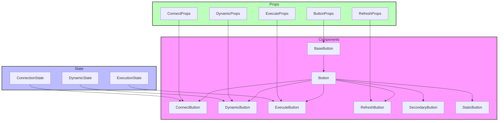

# Button Components

## Overview

Button components provide consistent, reusable button interfaces throughout the application. The components follow a modular design pattern with a base button component that can be extended for specific use cases.

## Directory Structure

```
📁 Button/
├── 📁 __llm__/
│   └── 📄 README.md
├── 📄 BaseButton.tsx
├── 📄 Button.tsx
├── 📄 ConnectButton.tsx
├── 📄 DynamicButton.tsx
├── 📄 ExecuteButton.tsx
├── 📄 RefreshButton.tsx
├── 📄 SecondaryButton.tsx
├── 📄 StaticButton.tsx
└── 📄 index.ts
```

## File Structure Documentation

```
📁 Button/
├── 📄 BaseButton.tsx           # Base button component
│   Last modified: 2024-01-08
│   Primary maintainer: Team
│   Dependencies: React, types
├── 📄 Button.tsx              # Main button component
│   Last modified: 2024-01-08
│   Primary maintainer: Team
│   Dependencies: React, BaseButton
├── 📄 ConnectButton.tsx       # Connection state button
│   Last modified: 2024-01-06
│   Primary maintainer: Team
│   Dependencies: React, Button
├── 📄 DynamicButton.tsx       # Dynamic state button
│   Last modified: 2024-01-08
│   Primary maintainer: Team
│   Dependencies: React, Button
├── 📄 ExecuteButton.tsx       # Execution action button
│   Last modified: 2024-01-08
│   Primary maintainer: Team
│   Dependencies: React, Button
├── 📄 RefreshButton.tsx       # Refresh action button
│   Last modified: 2024-01-08
│   Primary maintainer: Team
│   Dependencies: React, Button
├── 📄 SecondaryButton.tsx     # Secondary style button
│   Last modified: 2024-01-04
│   Primary maintainer: Team
│   Dependencies: React, Button
├── 📄 StaticButton.tsx        # Static state button
│   Last modified: 2024-01-08
│   Primary maintainer: Team
│   Dependencies: React, Button
└── 📄 index.ts                # Public exports
    Last modified: 2024-01-08
    Primary maintainer: Team
    Dependencies: All button components
```

## Architecture



## Available Components

### BaseButton

The foundation button component with configurable styles and behaviors.

```tsx
<Button
  icon="icon-name"
  iconPosition="start"
  loading={false}
  loadingText="Processing..."
  color="primary"
>
  Button Text
</Button>
```

### IconButton

Button variant optimized for icon-only interactions.

```tsx
<IconButton icon="refresh" label="Refresh Data" onClick={() => {}} />
```

### ConnectButton

Specialized button for connection state management.

```tsx
<ConnectButton
  isConnected={isConnected}
  isConnecting={isConnecting}
  onConnect={handleConnect}
  onDisconnect={handleDisconnect}
/>
```

### RefreshButton

Convenience button for refresh operations.

```tsx
<RefreshButton onPress={handleRefresh} loading={isLoading} />
```

## Props

### BaseButton Props

- `icon?: string` - Optional icon name
- `iconPosition?: 'start' | 'end'` - Icon placement
- `loading?: boolean` - Loading state
- `loadingText?: string` - Text during loading
- `color?: ButtonColor` - Button color variant
- `size?: 'sm' | 'md' | 'lg'` - Button size
- `disabled?: boolean` - Disabled state
- `className?: string` - Additional CSS classes

### IconButton Props

- `icon: string` - Required icon name
- `label: string` - Accessibility label
- `size?: 'sm' | 'md' | 'lg'` - Button size
- `onClick?: () => void` - Click handler

### ConnectButton Props

- `isConnected: boolean` - Connection state
- `isConnecting: boolean` - Connecting state
- `onConnect: () => void` - Connect handler
- `onDisconnect: () => void` - Disconnect handler
- `connectMessage?: string` - Custom connect text
- `disconnectMessage?: string` - Custom disconnect text

## Implementation Standards

### Component Guidelines

- Use TypeScript for all components
- Implement proper prop types and defaults
- Follow accessibility guidelines (WCAG 2.1)
- Use error boundaries for component isolation
- Implement proper loading states
- Handle edge cases gracefully

### Testing Requirements

1. Test all button states:

   - Default
   - Hover
   - Active
   - Disabled
   - Loading

2. Test accessibility:

   - Keyboard navigation
   - Screen reader compatibility
   - ARIA attributes

3. Test click handlers and state changes

4. Example test:

```tsx
describe("Button", () => {
  it("handles click events", () => {
    const onClick = jest.fn();
    render(<Button onClick={onClick}>Click Me</Button>);
    fireEvent.click(screen.getByText("Click Me"));
    expect(onClick).toHaveBeenCalled();
  });
});
```

## Best Practices

1. **State Management**

   - Use controlled components when possible
   - Implement proper state updates
   - Handle side effects properly

2. **Error Handling**

   - Implement proper error boundaries
   - Provide user feedback
   - Handle edge cases

3. **Performance**

   - Use React.memo for expensive renders
   - Implement proper dependencies
   - Profile and optimize render cycles

4. **Accessibility**
   - Use semantic HTML elements
   - Include proper ARIA attributes
   - Support keyboard navigation

```

```
