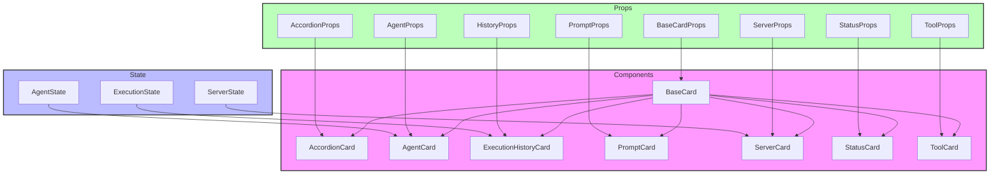

# Card Components

## Overview

Card components provide consistent containers for displaying grouped content with various layouts and purposes. The components follow a modular design pattern with a base card component that can be extended for specific use cases.

## Directory Structure

```
📁 Card/
├── 📁 __llm__/
│   └── 📄 README.md
├── 📁 __tests__/
│   └── 📄 Card.test.tsx
├── 📄 AccordionCard.tsx
├── 📄 AgentCard.tsx
├── 📄 BaseCard.tsx
├── 📄 ExecutionHistoryCard.tsx
├── 📄 PromptCard.tsx
├── 📄 ServerCard.tsx
├── 📄 StatusCard.tsx
├── 📄 ToolCard.tsx
└── 📄 index.ts
```

## File Structure Documentation

```
📁 Card/
├── 📄 AccordionCard.tsx         # Expandable card component
│   Last modified: 2024-01-07
│   Primary maintainer: Team
│   Dependencies: React, BaseCard
├── 📄 AgentCard.tsx            # Agent display card
│   Last modified: 2024-01-08
│   Primary maintainer: Team
│   Dependencies: React, BaseCard, agent-registry
├── 📄 BaseCard.tsx             # Base card component
│   Last modified: 2024-01-08
│   Primary maintainer: Team
│   Dependencies: React, types
├── 📄 ExecutionHistoryCard.tsx # Execution history display
│   Last modified: 2024-01-08
│   Primary maintainer: Team
│   Dependencies: React, BaseCard
├── 📄 PromptCard.tsx           # Prompt display card
│   Last modified: 2024-01-08
│   Primary maintainer: Team
│   Dependencies: React, BaseCard
├── 📄 ServerCard.tsx           # Server status card
│   Last modified: 2024-01-08
│   Primary maintainer: Team
│   Dependencies: React, BaseCard
├── 📄 StatusCard.tsx           # Status display card
│   Last modified: 2024-01-08
│   Primary maintainer: Team
│   Dependencies: React, BaseCard
├── 📄 ToolCard.tsx             # Tool display card
│   Last modified: 2024-01-08
│   Primary maintainer: Team
│   Dependencies: React, BaseCard
└── 📄 index.ts                 # Public exports
    Last modified: 2024-01-06
    Primary maintainer: Team
    Dependencies: All card components
```

## Architecture



## Available Components

### BaseCard

Foundation card component with header, content, and action areas.

```tsx
<BaseCard
  icon="icon-name"
  iconClassName="text-primary"
  title="Card Title"
  subtitle="Optional subtitle"
  headerAction={<Button />}
  isLoading={false}
  isEmpty={false}
>
  {/* Card content */}
</BaseCard>
```

### StatusCard

Card variant for displaying status information and details.

```tsx
<StatusCard
  status="success"
  title="Connection Status"
  description="Server is running"
  icon="server"
  details={[
    { label: "Status", value: "Connected" },
    { label: "Type", value: "Primary" },
  ]}
/>
```

### ToolCard

Specialized card for tool information and actions.

```tsx
<ToolCard
  name="Tool Name"
  description="Tool description"
  type="Tool"
  isLoading={false}
  isEmpty={false}
  onExecute={() => handleExecute()}
/>
```

## Props

### BaseCard Props

- `icon?: string` - Optional header icon
- `iconClassName?: string` - Icon styling
- `title: ReactNode` - Card title
- `subtitle?: ReactNode` - Optional subtitle
- `headerAction?: ReactNode` - Optional header action
- `isLoading?: boolean` - Loading state
- `isEmpty?: boolean` - Empty state
- `children: ReactNode` - Card content

### StatusCard Props

- `status: 'success' | 'warning' | 'danger' | 'default'` - Status type
- `title: string` - Status title
- `description?: string` - Status description
- `icon?: string` - Status icon
- `details?: Array<{label: string, value: string}>` - Detail items

### ToolCard Props

- `name: string` - Tool name
- `description: string` - Tool description
- `type: string` - Tool type
- `isLoading?: boolean` - Loading state
- `isEmpty?: boolean` - Empty state
- `onExecute?: () => void` - Execute handler

## Implementation Standards

### Component Guidelines

- Use TypeScript for all components
- Implement proper prop types and defaults
- Follow accessibility guidelines (WCAG 2.1)
- Use error boundaries for component isolation
- Implement proper loading states
- Handle edge cases gracefully

### Testing Requirements

1. Test card states:

   - Default render
   - Loading state
   - Empty state
   - With/without optional elements

2. Test interactions:

   - Header actions
   - Content interactions
   - Tool execution

3. Test accessibility:

   - Heading hierarchy
   - ARIA attributes
   - Keyboard navigation

4. Example test:

```tsx
describe("Card", () => {
  it("renders with title and content", () => {
    render(
      <BaseCard title="Test Card">
        <p>Card content</p>
      </BaseCard>
    );
    expect(screen.getByText("Test Card")).toBeInTheDocument();
    expect(screen.getByText("Card content")).toBeInTheDocument();
  });
});
```

## Best Practices

1. **State Management**

   - Use controlled components when possible
   - Implement proper state updates
   - Handle side effects properly

2. **Error Handling**

   - Implement proper error boundaries
   - Provide user feedback
   - Handle edge cases

3. **Performance**

   - Use React.memo for expensive renders
   - Implement proper dependencies
   - Profile and optimize render cycles

4. **Accessibility**
   - Use semantic HTML elements
   - Include proper ARIA attributes
   - Support keyboard navigation
