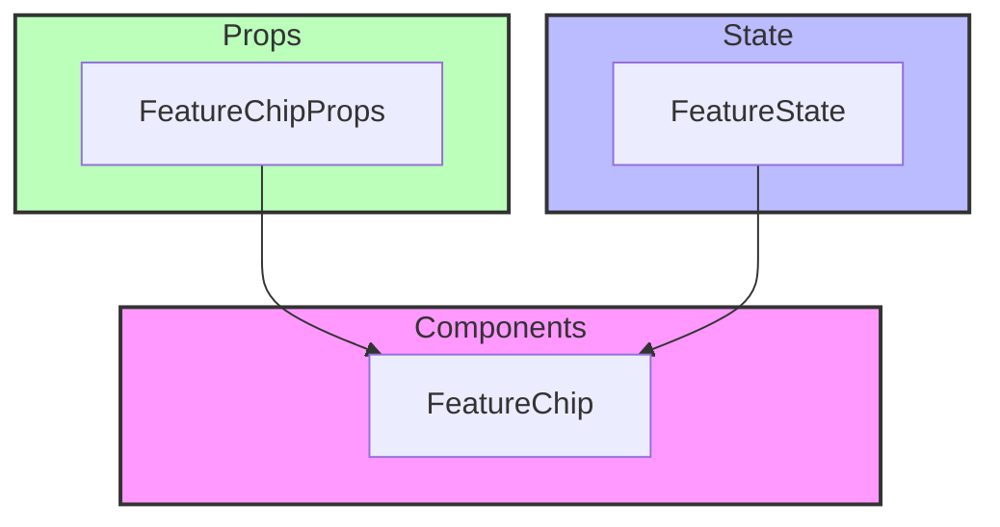

# Chip Components

## Overview

Chip components provide compact elements for displaying information, tags, or status indicators. The components follow a modular design pattern with a base chip component that can be extended for specific use cases.

## Directory Structure

```
📁 Chip/
├── 📁 __llm__/
│   └── 📄 README.md
├── 📄 FeatureChip.tsx
└── 📄 index.ts
```

## File Structure Documentation

```
📁 Chip/
├── 📄 FeatureChip.tsx          # Feature indicator chip
│   Last modified: 2024-01-08
│   Primary maintainer: Team
│   Dependencies: React, types
└── 📄 index.ts                 # Public exports
    Last modified: 2024-01-08
    Primary maintainer: Team
    Dependencies: FeatureChip
```

## Architecture



## Available Components

### FeatureChip

Specialized chip for displaying feature information and status.

```tsx
<FeatureChip
  label="Feature Name"
  status="active"
  icon="feature-icon"
  onClick={() => handleClick()}
/>
```

## Props

### FeatureChip Props

- `label: string` - Feature name
- `status?: 'active' | 'inactive' | 'pending'` - Feature status
- `icon?: string` - Optional feature icon
- `onClick?: () => void` - Optional click handler
- `className?: string` - Additional CSS classes
- `disabled?: boolean` - Disabled state
- `size?: 'sm' | 'md' | 'lg'` - Chip size
- `variant?: 'filled' | 'outlined'` - Visual variant

## Implementation Standards

### Component Guidelines

- Use TypeScript for all components
- Implement proper prop types and defaults
- Follow accessibility guidelines (WCAG 2.1)
- Use error boundaries for component isolation
- Implement proper loading states
- Handle edge cases gracefully

### Testing Requirements

1. Test chip states:

   - Default render
   - With/without icon
   - Different statuses
   - Different sizes and variants
   - Disabled state

2. Test interactions:

   - Click events
   - Hover states
   - Focus management
   - Keyboard navigation

3. Test accessibility:

   - ARIA attributes
   - Keyboard navigation
   - Screen reader compatibility

4. Example test:

```tsx
describe("FeatureChip", () => {
  it("handles click event", () => {
    const onClick = jest.fn();
    render(<FeatureChip label="Test" onClick={onClick} />);
    fireEvent.click(screen.getByText("Test"));
    expect(onClick).toHaveBeenCalled();
  });

  it("respects disabled state", () => {
    const onClick = jest.fn();
    render(<FeatureChip label="Test" onClick={onClick} disabled />);
    fireEvent.click(screen.getByText("Test"));
    expect(onClick).not.toHaveBeenCalled();
  });
});
```

## Best Practices

1. **State Management**

   - Use controlled components when possible
   - Implement proper state updates
   - Handle side effects properly

2. **Error Handling**

   - Implement proper error boundaries
   - Provide user feedback
   - Handle edge cases

3. **Performance**

   - Use React.memo for expensive renders
   - Implement proper dependencies
   - Profile and optimize render cycles

4. **Accessibility**
   - Use semantic HTML elements
   - Include proper ARIA attributes
   - Support keyboard navigation
   - Ensure sufficient color contrast
   - Provide clear focus indicators

```

```
