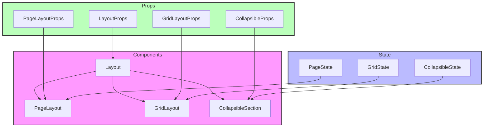

# Layout Components

## Overview

The Layout components serve as the main structural wrappers for pages and content sections in the application. They provide consistent spacing, padding, and structural organization across different views, following a modular design pattern.

## Directory Structure

```
📁 Layout/
├── 📁 __llm__/
│   └── 📄 README.md
├── 📄 CollapsibleSection.tsx
├── 📄 GridLayout.tsx
├── 📄 Layout.tsx
├── 📄 PageLayout.tsx
└── 📄 index.ts
```

## File Structure Documentation

```
📁 Layout/
├── 📄 CollapsibleSection.tsx    # Collapsible content section
│   Last modified: 2024-01-03
│   Primary maintainer: Team
│   Dependencies: React
├── 📄 GridLayout.tsx           # Grid-based layout system
│   Last modified: 2024-01-04
│   Primary maintainer: Team
│   Dependencies: React
├── 📄 Layout.tsx               # Main layout component
│   Last modified: 2024-01-08
│   Primary maintainer: Team
│   Dependencies: React
├── 📄 PageLayout.tsx           # Page-specific layout
│   Last modified: 2024-01-08
│   Primary maintainer: Team
│   Dependencies: React, Layout
└── 📄 index.ts                 # Public exports
    Last modified: 2024-01-08
    Primary maintainer: Team
    Dependencies: All layout components
```

## Architecture



## Available Components

### Layout

Main layout component with configurable variants.

```tsx
<Layout variant="default" padding={true}>
  <YourContent />
</Layout>
```

### PageLayout

Specialized layout for full pages with header and content areas.

```tsx
<PageLayout
  header={<Header />}
  sidebar={<Sidebar />}
  content={<MainContent />}
/>
```

### GridLayout

Grid-based layout system for organized content placement.

```tsx
<GridLayout columns={3} gap={4}>
  <GridItem>Content 1</GridItem>
  <GridItem>Content 2</GridItem>
  <GridItem>Content 3</GridItem>
</GridLayout>
```

### CollapsibleSection

Expandable/collapsible content section.

```tsx
<CollapsibleSection
  title="Section Title"
  defaultExpanded={true}
  onToggle={(expanded) => console.log(expanded)}
>
  <SectionContent />
</CollapsibleSection>
```

## Props

### Layout Props

- `children: ReactNode` - Content to be rendered
- `variant?: 'default' | 'minimal' | 'full-width'` - Layout style
- `className?: string` - Additional CSS classes
- `padding?: boolean` - Enable/disable padding

### PageLayout Props

- `header?: ReactNode` - Page header content
- `sidebar?: ReactNode` - Sidebar content
- `content: ReactNode` - Main page content
- `className?: string` - Additional CSS classes
- `sidebarCollapsed?: boolean` - Sidebar state

### GridLayout Props

- `children: ReactNode` - Grid items
- `columns?: number` - Number of columns
- `gap?: number` - Grid gap size
- `className?: string` - Additional CSS classes
- `responsive?: boolean` - Enable responsive behavior

### CollapsibleSection Props

- `title: ReactNode` - Section title
- `children: ReactNode` - Section content
- `defaultExpanded?: boolean` - Initial expanded state
- `onToggle?: (expanded: boolean) => void` - Toggle handler
- `className?: string` - Additional CSS classes

## Implementation Standards

### Component Guidelines

- Use TypeScript for all components
- Implement proper prop types and defaults
- Follow accessibility guidelines (WCAG 2.1)
- Use semantic HTML structure
- Support responsive design
- Handle edge cases gracefully

### Testing Requirements

1. Layout rendering:

   - All variants render correctly
   - Proper spacing and padding
   - Responsive behavior
   - Content overflow handling

2. Interactions:

   - Collapsible sections work
   - Grid responsiveness
   - Sidebar toggling
   - Content scrolling

3. Accessibility:

   - Semantic structure
   - Keyboard navigation
   - Screen reader support
   - Focus management

4. Example test:

```tsx
describe("Layout", () => {
  it("renders with correct variant", () => {
    render(
      <Layout variant="minimal">
        <div>Content</div>
      </Layout>
    );
    expect(screen.getByText("Content")).toBeInTheDocument();
    expect(screen.getByRole("main")).toHaveClass("layout-minimal");
  });

  it("handles padding prop", () => {
    render(
      <Layout padding={false}>
        <div>Content</div>
      </Layout>
    );
    expect(screen.getByRole("main")).not.toHaveClass("layout-padding");
  });
});
```

## Best Practices

1. **Structure**

   - Use semantic HTML elements
   - Maintain proper heading hierarchy
   - Follow consistent spacing patterns
   - Support proper content nesting

2. **Responsiveness**

   - Use fluid layouts
   - Implement proper breakpoints
   - Handle content overflow
   - Support different screen sizes

3. **Performance**

   - Minimize layout shifts
   - Optimize reflows and repaints
   - Use CSS Grid/Flexbox efficiently
   - Implement proper will-change hints

4. **Accessibility**
   - Use proper landmarks
   - Maintain focus order
   - Support keyboard navigation
   - Provide skip links when needed

```

```
