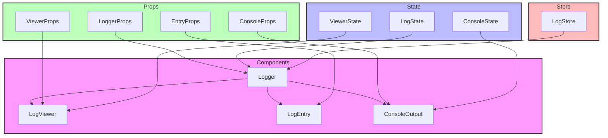

# Logger Components

## Overview

Logger components provide debugging and monitoring interfaces for displaying application logs and debug information. The components follow a modular design pattern with a base logger component that can be extended for specific use cases.

## Directory Structure

```
📁 Logger/
├── 📁 __llm__/
│   └── 📄 README.md
└── 📄 Logger.tsx
```

## File Structure Documentation

```
📁 Logger/
├── 📄 Logger.tsx               # Main logger component
│   Last modified: 2024-01-07
│   Primary maintainer: Team
│   Dependencies: React, types
└── 📁 __llm__/
    └── 📄 README.md            # Component documentation
        Last modified: 2024-01-08
        Primary maintainer: Team
        Dependencies: None
```

## Architecture



## Available Components

### LogViewer

Main component for displaying log entries with filtering and search.

```tsx
<LogViewer
  logs={logEntries}
  level="info"
  onClear={() => {}}
  onLevelChange={(level) => {}}
/>
```

### LogEntry

Individual log entry display with timestamp and level.

```tsx
<LogEntry
  timestamp={new Date()}
  level="error"
  message="Error occurred"
  details={{ error: "Details" }}
/>
```

### ConsoleOutput

Terminal-like console output display.

```tsx
<ConsoleOutput lines={outputLines} maxLines={100} autoScroll={true} />
```

## Props

### LogViewer Props

- `logs: LogEntry[]` - Array of log entries
- `level?: LogLevel` - Current filter level
- `onClear?: () => void` - Clear logs handler
- `onLevelChange?: (level: LogLevel) => void` - Level filter handler
- `className?: string` - Additional CSS classes
- `maxHeight?: string | number` - Maximum height of viewer

### LogEntry Props

- `timestamp: Date` - Entry timestamp
- `level: 'debug' | 'info' | 'warn' | 'error'` - Log level
- `message: string` - Log message
- `details?: object` - Additional log details
- `className?: string` - Additional CSS classes

### ConsoleOutput Props

- `lines: string[]` - Output lines
- `maxLines?: number` - Maximum lines to display
- `autoScroll?: boolean` - Auto-scroll to bottom
- `className?: string` - Additional CSS classes
- `monospace?: boolean` - Use monospace font

## Implementation Standards

### Component Guidelines

- Use TypeScript for all components
- Implement proper prop types and defaults
- Follow accessibility guidelines (WCAG 2.1)
- Use semantic HTML structure
- Support virtual scrolling for large logs
- Handle edge cases gracefully

### Testing Requirements

1. Log display functionality:

   - Different log levels render correctly
   - Timestamp formatting is consistent
   - Message truncation works properly
   - Details expansion/collapse works
   - Virtual scrolling performs well

2. Filtering and search:

   - Level filtering works correctly
   - Text search is accurate
   - Clear functionality works
   - Max lines limit is enforced
   - Filter combinations work

3. Accessibility:

   - Keyboard navigation works
   - Screen reader support is proper
   - Focus management is correct
   - Color contrast meets standards

4. Example test:

```tsx
describe("LogViewer", () => {
  it("filters logs by level", () => {
    const logs = [
      { level: "error", message: "Error log" },
      { level: "info", message: "Info log" },
    ];
    render(<LogViewer logs={logs} level="error" />);
    expect(screen.getByText("Error log")).toBeInTheDocument();
    expect(screen.queryByText("Info log")).not.toBeInTheDocument();
  });

  it("handles large log volumes", () => {
    const logs = Array.from({ length: 1000 }, (_, i) => ({
      level: "info",
      message: `Log ${i}`,
    }));
    render(<LogViewer logs={logs} />);
    expect(screen.getByRole("log")).toBeInTheDocument();
    // Virtual scrolling should be active
    expect(document.querySelectorAll(".log-entry")).toHaveLength(50);
  });
});
```

## Best Practices

1. **Performance**

   - Use virtual scrolling for large logs
   - Implement proper memoization
   - Optimize render cycles
   - Handle large data volumes efficiently

2. **Memory Management**

   - Implement log rotation
   - Clear old logs automatically
   - Limit maximum log entries
   - Handle memory constraints

3. **User Experience**

   - Provide clear log level indicators
   - Implement proper timestamp formatting
   - Support log entry expansion
   - Enable easy log filtering

4. **Accessibility**
   - Use semantic log structure
   - Provide keyboard shortcuts
   - Support screen readers
   - Maintain proper focus management

```

```
