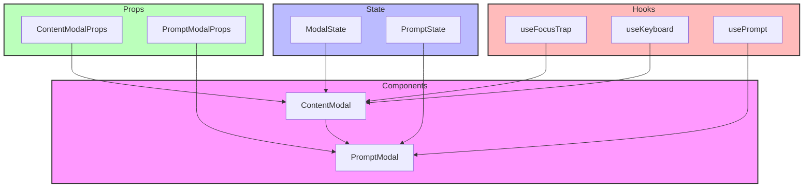

# Modal Components

## Overview

The Modal components provide reusable overlay dialogs that can be used to display content on top of the main application. They handle accessibility, keyboard interactions, and backdrop clicks, following a modular design pattern.

## Directory Structure

```
📁 Modal/
├── 📁 __llm__/
│   └── 📄 README.md
├── 📄 ContentModal.tsx
├── 📄 PromptModal.tsx
└── 📄 index.ts
```

## File Structure Documentation

```
📁 Modal/
├── 📄 ContentModal.tsx         # Generic content modal
│   Last modified: 2024-01-08
│   Primary maintainer: Team
│   Dependencies: React
├── 📄 PromptModal.tsx          # Prompt-specific modal
│   Last modified: 2024-01-08
│   Primary maintainer: Team
│   Dependencies: React, ContentModal
└── 📁 __llm__/
    └── 📄 README.md            # Component documentation
        Last modified: 2024-01-08
        Primary maintainer: Team
        Dependencies: None
```

## Architecture



## Available Components

### ContentModal

Base modal component for displaying generic content.

```tsx
<ContentModal
  isOpen={isOpen}
  onClose={handleClose}
  title="Modal Title"
  size="md"
  position="center"
>
  <ContentModal.Header>Title</ContentModal.Header>
  <ContentModal.Body>Content goes here</ContentModal.Body>
  <ContentModal.Footer>
    <Button onClick={handleClose}>Close</Button>
  </ContentModal.Footer>
</ContentModal>
```

### PromptModal

Specialized modal for prompt interactions.

```tsx
<PromptModal
  isOpen={isOpen}
  onClose={handleClose}
  prompt={promptData}
  onSubmit={handleSubmit}
  isLoading={false}
/>
```

## Props

### ContentModal Props

- `isOpen: boolean` - Controls modal visibility
- `onClose: () => void` - Close handler
- `children: ReactNode` - Modal content
- `title?: string` - Modal title
- `size?: 'sm' | 'md' | 'lg' | 'full'` - Modal size
- `position?: 'center' | 'right'` - Modal position
- `className?: string` - Additional CSS classes
- `closeOnBackdrop?: boolean` - Close on backdrop click
- `closeOnEscape?: boolean` - Close on Escape key

### PromptModal Props

- `isOpen: boolean` - Controls modal visibility
- `onClose: () => void` - Close handler
- `prompt: PromptData` - Prompt configuration
- `onSubmit: (data: any) => void` - Submit handler
- `isLoading?: boolean` - Loading state
- `className?: string` - Additional CSS classes
- `size?: 'sm' | 'md' | 'lg'` - Modal size

## Implementation Standards

### Component Guidelines

- Use TypeScript for all components
- Implement proper prop types and defaults
- Follow accessibility guidelines (WCAG 2.1)
- Use semantic HTML structure
- Support keyboard navigation
- Handle edge cases gracefully

### Testing Requirements

1. Modal functionality:

   - Open/close behavior works
   - Backdrop click handling
   - Escape key handling
   - Size and position variants
   - Content rendering

2. Interactions:

   - Focus trap works
   - Keyboard navigation
   - Form submissions
   - Loading states

3. Accessibility:

   - ARIA attributes
   - Focus management
   - Screen reader support
   - Keyboard shortcuts

4. Example test:

```tsx
describe("ContentModal", () => {
  it("handles open/close state", () => {
    const onClose = jest.fn();
    const { rerender } = render(
      <ContentModal isOpen={false} onClose={onClose}>
        Content
      </ContentModal>
    );
    expect(screen.queryByText("Content")).not.toBeInTheDocument();

    rerender(
      <ContentModal isOpen={true} onClose={onClose}>
        Content
      </ContentModal>
    );
    expect(screen.getByText("Content")).toBeInTheDocument();
  });

  it("handles escape key", () => {
    const onClose = jest.fn();
    render(
      <ContentModal isOpen={true} onClose={onClose}>
        Content
      </ContentModal>
    );
    fireEvent.keyDown(document, { key: "Escape" });
    expect(onClose).toHaveBeenCalled();
  });
});
```

## Best Practices

1. **Accessibility**

   - Trap focus within modal
   - Support keyboard navigation
   - Use proper ARIA roles
   - Manage focus on open/close
   - Support screen readers

2. **Performance**

   - Lazy load modal content
   - Use React.memo when needed
   - Optimize animations
   - Handle large content gracefully

3. **User Experience**

   - Provide clear close buttons
   - Support escape key
   - Add transition animations
   - Handle loading states
   - Show proper error states

4. **Composition**
   - Use compound components
   - Support content customization
   - Allow header/footer overrides
   - Enable flexible layouts
