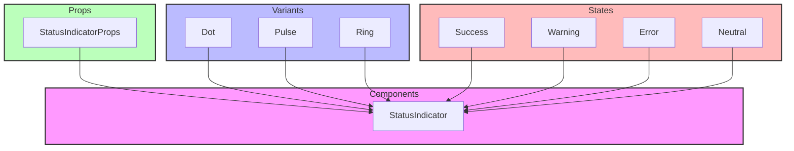

# StatusIndicator Component

## Overview

The StatusIndicator component provides a visual representation of various states through colored indicators. It's commonly used to show status, progress, or availability in the interface, following a modular design pattern.

## Directory Structure

```
📁 StatusIndicator/
├── 📁 __llm__/
│   └── 📄 README.md
├── 📁 __tests__/
│   └── 📄 StatusIndicator.test.tsx
└── 📄 StatusIndicator.tsx
```

## File Structure Documentation

```
📁 StatusIndicator/
├── 📄 StatusIndicator.tsx      # Main component
│   Last modified: 2024-01-08
│   Primary maintainer: Team
│   Dependencies: React, types
├── 📁 __tests__/
│   └── 📄 StatusIndicator.test.tsx  # Component tests
│       Last modified: 2024-01-04
│       Primary maintainer: Team
│       Dependencies: React, testing-library
└── 📁 __llm__/
    └── 📄 README.md            # Component documentation
        Last modified: 2024-01-08
        Primary maintainer: Team
        Dependencies: None
```

## Architecture



## Available Variants

### Dot Indicator

Simple circular indicator for basic status display.

```tsx
<StatusIndicator status="success" variant="dot" />
```

### Pulse Indicator

Animated pulsing indicator for active states.

```tsx
<StatusIndicator status="warning" variant="pulse" />
```

### Ring Indicator

Circular outline indicator for subtle status display.

```tsx
<StatusIndicator status="error" variant="ring" size="lg" />
```

## Props

### StatusIndicator Props

- `variant?: 'dot' | 'pulse' | 'ring'` - Visual style
- `status?: 'success' | 'warning' | 'error' | 'neutral'` - Status type
- `size?: 'sm' | 'md' | 'lg'` - Indicator size
- `className?: string` - Additional CSS classes
- `label?: string` - Accessibility label
- `animated?: boolean` - Enable animation
- `pulseSpeed?: 'slow' | 'normal' | 'fast'` - Animation speed

## Implementation Standards

### Component Guidelines

- Use TypeScript for all components
- Implement proper prop types and defaults
- Follow accessibility guidelines (WCAG 2.1)
- Use semantic HTML structure
- Support color customization
- Handle edge cases gracefully

### Testing Requirements

1. Visual states:

   - All variants render correctly
   - Status colors are correct
   - Sizes are consistent
   - Animations work properly
   - Custom classes apply

2. Accessibility:

   - ARIA labels are present
   - Color contrast meets standards
   - Screen reader support works
   - Focus states are visible

3. Customization:

   - Custom colors work
   - Size variations apply
   - Animation controls work
   - Class overrides work

4. Example test:

```tsx
describe("StatusIndicator", () => {
  it("renders with correct status", () => {
    render(<StatusIndicator status="success" />);
    expect(screen.getByRole("status")).toHaveClass("status-success");
  });

  it("applies correct variant", () => {
    render(<StatusIndicator variant="pulse" status="warning" />);
    const indicator = screen.getByRole("status");
    expect(indicator).toHaveClass("variant-pulse");
    expect(indicator).toHaveClass("status-warning");
  });

  it("handles size prop", () => {
    render(<StatusIndicator size="lg" />);
    expect(screen.getByRole("status")).toHaveClass("size-lg");
  });

  it("supports custom labels", () => {
    render(<StatusIndicator label="System Status" status="error" />);
    expect(screen.getByLabelText("System Status")).toBeInTheDocument();
  });
});
```

## Best Practices

1. **Visual Design**

   - Use consistent colors
   - Maintain proper sizing
   - Keep animations subtle
   - Support dark/light modes
   - Follow design system

2. **Accessibility**

   - Provide meaningful labels
   - Ensure color contrast
   - Support reduced motion
   - Use semantic markup
   - Include ARIA states

3. **Performance**

   - Optimize animations
   - Use CSS variables
   - Minimize repaints
   - Handle state changes efficiently

4. **Integration**
   - Support system themes
   - Enable easy styling
   - Allow variant composition
   - Maintain consistency

```

```
