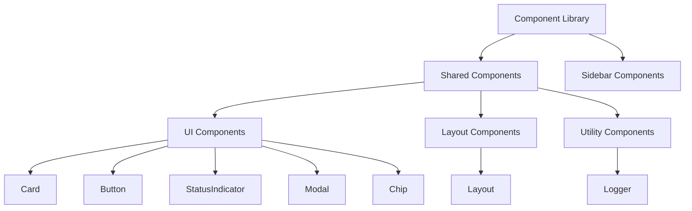

# Shared Component Library Guide

## Directory Structure

```
� components/
├── 📁 Card/
│   ├── 📁 __llm__/
│   │   └── 📄 README.md
│   └── 📄 [Component Files]
├── 📁 Button/
│   ├── 📁 __llm__/
│   │   └── 📄 README.md
│   └── 📄 [Component Files]
├── 📁 StatusIndicator/
├── 📁 Modal/
├── 📁 Layout/
├── 📁 Chip/
├── 📁 Logger/
├── 📁 sidebar/
└── 📁 __llm__/
    ├── 📄 README.md
```

## Core Principles

1. **Generic First**: Components should be generic and reusable across different contexts
2. **Composition Over Inheritance**: Build complex UIs by composing simple components
3. **Consistent Styling**: Use Tailwind CSS and NextUI for consistent design language
4. **Type Safety**: Utilize TypeScript for robust component interfaces
5. **Accessibility**: Follow ARIA best practices and keyboard navigation standards

## Architecture



## Component Architecture

### Card Components

#### BaseCard

- Foundation for all card-based UIs
- Supports loading, empty states, and header actions
- Usage:

```tsx
<BaseCard
  icon="icon-name"
  iconClassName="text-primary"
  title="Card Title"
  subtitle="Optional subtitle"
  headerAction={<Button />}
  isLoading={false}
  isEmpty={false}
>
  {/* Card content */}
</BaseCard>
```

#### StatusCard

- Extends BaseCard for displaying status information
- Includes status indicator, details grid, and status dot
- Supports multiple status types: success, warning, danger, default
- Usage:

```tsx
<StatusCard
  status="success"
  title="Connection Status"
  description="Server is running and responding"
  icon="solar:monitor-smartphone-line-duotone"
  details={[
    { label: "Status", value: "Connected" },
    { label: "Type", value: "Primary" },
  ]}
/>
```

#### ToolCard

- Specialized card for displaying tool information and actions
- Supports loading, empty states, and execute functionality
- Usage:

```tsx
<ToolCard
  name="Tool Name"
  description="Tool description"
  type="Tool"
  isLoading={false}
  isEmpty={false}
  onExecute={() => handleExecute()}
>
  {/* Optional custom content */}
</ToolCard>
```

### Button Components

#### Base Button

- Foundation button component with icon support
- Variants: default, icon-only, action
- Usage:

```tsx
<Button
  icon="icon-name"
  iconPosition="start"
  loading={false}
  loadingText="Processing..."
  color="primary"
>
  Button Text
</Button>

<IconButton
  icon="refresh"
  label="Refresh Data"
/>

<ActionButton
  actionIcon="play"
  actionText="Execute Action"
/>
```

#### ConnectButton

- Specialized button for connection states
- Handles connected, connecting, and disconnected states
- Usage:

```tsx
<ConnectButton
  isConnected={isConnected}
  isConnecting={isConnecting}
  onConnect={handleConnect}
  onDisconnect={handleDisconnect}
  connectMessage="Connect"
  disconnectMessage="Disconnect"
  connectingMessage="Connecting..."
  size="md"
/>
```

#### RefreshButton

- Convenience button for refresh actions
- Built-in loading state and icon
- Usage:

```tsx
<RefreshButton onPress={handleRefresh} loading={isLoading} />
```

### Status Components

#### StatusIndicator

- Consistent status messaging across the app
- Supports multiple states: success, warning, danger, default
- Includes icon and description
- Usage:

```tsx
<StatusIndicator
  type="success"
  title="Operation Successful"
  description="Optional details about the status"
  icon="custom-icon"
/>
```

### Modal Components

#### PromptModal

- Base modal component for all prompt-related interactions
- Supports parameter input, validation, and execution
- Features:
  - Dynamic form generation from JSON Schema
  - Validation error handling
  - Loading states
  - Preview/Result display
  - Customizable actions
- Usage:

```tsx
<PromptModal
  isOpen={isOpen}
  onClose={handleClose}
  title="Execute Prompt"
  description="Enter parameters to execute the prompt"
  parameters={promptSchema}
  parameterValues={values}
  onParameterChange={handleChange}
  validationErrors={errors}
  requiredParameters={["name"]}
  primaryAction={{
    label: "Execute",
    onClick: handleExecute,
    isLoading: false,
  }}
/>
```

## Styling Guidelines

### Tailwind CSS

- Use Tailwind utility classes for styling
- Follow mobile-first responsive design
- Common patterns:
  - Spacing: `p-4`, `m-2`, `gap-3`
  - Flexbox: `flex`, `items-center`, `justify-between`
  - Grid: `grid`, `grid-cols-{n}`
  - Colors: `text-primary`, `bg-default-50`
  - States: `hover:bg-default-100`, `focus:ring-2`

### NextUI Integration

- Extend NextUI components for advanced functionality
- Use NextUI's theme system for consistent styling
- Common components:
  - `Card`, `Button`, `Input`, `Dropdown`
  - Follow NextUI's prop patterns for consistency

## Testing

Components should include comprehensive tests:

- Unit tests for component logic
- Rendering tests for different states
- Accessibility tests
- Mock external dependencies (e.g., icons)

Example test structure:

```tsx
describe("ComponentName", () => {
  it("renders with default props", () => {
    // Test default rendering
  });

  it("handles different states", () => {
    // Test loading, empty, error states
  });

  it("responds to user interactions", () => {
    // Test click handlers, etc.
  });
});
```

## Creating New Components

1. **Evaluate Need**

   - Check if existing components can be composed
   - Ensure the component serves a generic purpose

2. **Component Structure**

   - Place in appropriate directory under `src/components/shared`
   - Create with TypeScript interface for props
   - Include proper JSDoc documentation

3. **Implementation Guidelines**

   - Make components as generic as possible
   - Support customization through props
   - Include loading and error states
   - Support responsive design
   - Implement proper accessibility attributes

4. **Example Template**

```tsx
interface NewComponentProps {
  // Required props
  title: React.ReactNode;
  // Optional props with defaults
  variant?: "default" | "alternate";
  className?: string;
}

export function NewComponent({
  title,
  variant = "default",
  className = "",
}: NewComponentProps) {
  return (
    <div className={`base-styles ${variant - styles} ${className}`}>
      {/* Component implementation */}
    </div>
  );
}
```

## Best Practices

1. **Component Composition**

   - Break down complex UIs into smaller, reusable components
   - Use composition to build feature-specific components

2. **Props Design**

   - Make boolean props default to false
   - Provide sensible defaults for optional props
   - Use consistent prop naming across components

3. **Performance**

   - Implement proper memoization where needed
   - Avoid unnecessary re-renders
   - Keep components focused and lightweight

4. **Testing**

   - Write unit tests for all components
   - Test different states and edge cases
   - Include accessibility tests

5. **Documentation**
   - Keep this guide updated with new components
   - Include usage examples in component files
   - Document any breaking changes

## File Metadata 📊

| Component       | Primary Maintainer | Test Coverage | Dependencies  |
| --------------- | ------------------ | ------------- | ------------- |
| Card            | Team               | ✅            | NextUI, Icons |
| Button          | Team               | ✅            | NextUI        |
| StatusIndicator | Team               | ✅            | NextUI, Icons |
| Modal           | Team               | ✅            | NextUI        |
| Layout          | Team               | ✅            | NextUI        |
| Chip            | Team               | ✅            | NextUI        |
| Logger          | Team               | ✅            | -             |

## Architecture Decisions

### ADR-001: NextUI Integration

**Status**: Accepted  
**Context**: Need for consistent, accessible UI components  
**Decision**: Use NextUI as the base component library  
**Consequences**:

- Pros: Consistent design, accessibility built-in
- Cons: Additional dependency, version management needed

### ADR-002: Tailwind CSS Usage

**Status**: Accepted  
**Context**: Need for utility-first CSS approach  
**Decision**: Use Tailwind CSS for styling  
**Consequences**:

- Pros: Rapid development, consistent spacing/colors
- Cons: Learning curve for new developers

## Changelog

### [1.0.0] - 2024-01-08

- Initial documentation structure
- Added architecture diagrams
- Added component metadata
- Added ADRs

## Implementation Standards

### Component Structure

Each component should follow this structure:

```
📁 ComponentName/
├── 📁 __llm__/
│   └── 📄 README.md
├── 📄 index.ts
├── 📄 ComponentName.tsx
├── 📄 ComponentName.test.tsx
└── 📄 types.ts
```

### File Naming Conventions

- Component files: PascalCase (e.g., `BaseCard.tsx`)
- Test files: ComponentName.test.tsx
- Type files: types.ts
- Index files: index.ts (for exports)

### Code Organization

1. Imports
2. Types/Interfaces
3. Constants
4. Component Definition
5. Helper Functions
6. Exports

### Documentation Requirements

Each component must include:

- TypeScript interfaces for props
- JSDoc comments for public methods
- Usage examples
- Props documentation
- Accessibility considerations

## Quality Standards

### Testing Requirements

- Unit tests for all components
- Integration tests for complex interactions
- Accessibility tests (ARIA compliance)
- Visual regression tests for UI components

### Performance Guidelines

- Lazy loading for large components
- Memoization for expensive computations
- Efficient re-rendering strategies
- Bundle size optimization

### Accessibility Standards

- ARIA labels and roles
- Keyboard navigation
- Color contrast compliance
- Screen reader support

## Development Workflow

1. **Planning**

   - Review existing components
   - Define component interface
   - Document requirements

2. **Implementation**

   - Create component structure
   - Write tests first (TDD)
   - Implement component
   - Add documentation

3. **Review Process**

   - Code review
   - Documentation review
   - Accessibility review
   - Performance review

4. **Maintenance**
   - Version control
   - Change documentation
   - Update tests
   - Performance monitoring

## Version Control

- Follow semantic versioning
- Document breaking changes
- Maintain changelog
- Tag releases

## Resources

- [Tailwind CSS Documentation](https://tailwindcss.com/docs)
- [NextUI Components](https://nextui.org)
- [React TypeScript Guidelines](https://react-typescript-cheatsheet.netlify.app/)
- [ARIA Practices Guide](https://www.w3.org/WAI/ARIA/apg/)
