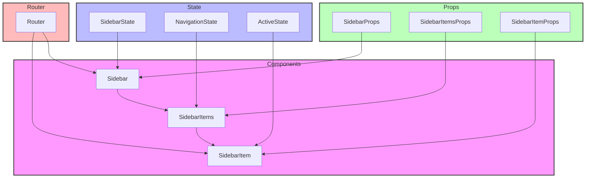

# Sidebar Components

## Overview

The Sidebar components provide navigation and organizational structure for the application. They follow a modular design pattern with composable items and sections for flexible navigation layouts.

## Directory Structure

```
📁 sidebar/
├── 📁 __llm__/
│   └── 📄 README.md
├── 📁 __tests__/
│   └── 📄 sidebar.test.tsx
├── 📄 index.tsx
├── 📄 sidebar-item.tsx
├── 📄 sidebar-items.tsx
└── 📄 types.ts
```

## File Structure Documentation

```
📁 sidebar/
├── 📄 index.tsx               # Main sidebar component
│   Last modified: 2024-01-08
│   Primary maintainer: Team
│   Dependencies: React, types
├── 📄 sidebar-item.tsx        # Individual item component
│   Last modified: 2024-01-08
│   Primary maintainer: Team
│   Dependencies: React, types
├── 📄 sidebar-items.tsx       # Item collection component
│   Last modified: 2024-01-08
│   Primary maintainer: Team
│   Dependencies: React, types, sidebar-item
├── 📄 types.ts                # Type definitions
│   Last modified: 2024-01-08
│   Primary maintainer: Team
│   Dependencies: None
└── 📁 __tests__/
    └── 📄 sidebar.test.tsx    # Component tests
        Last modified: 2024-01-08
        Primary maintainer: Team
        Dependencies: React, testing-library
```

## Architecture



## Available Components

### Sidebar

Main container component for navigation structure.

```tsx
<Sidebar
  items={navigationItems}
  activeItem="dashboard"
  onItemClick={handleNavigation}
  collapsed={false}
/>
```

### SidebarItems

Collection component for organizing navigation items.

```tsx
<SidebarItems items={sectionItems} title="Main Navigation" collapsible={true} />
```

### SidebarItem

Individual navigation item component.

```tsx
<SidebarItem
  label="Dashboard"
  icon="dashboard"
  href="/dashboard"
  active={true}
/>
```

## Props

### Sidebar Props

- `items: SidebarItem[]` - Navigation items
- `activeItem?: string` - Current active item
- `onItemClick?: (item: SidebarItem) => void` - Click handler
- `collapsed?: boolean` - Collapsed state
- `className?: string` - Additional CSS classes
- `width?: number | string` - Sidebar width
- `position?: 'left' | 'right'` - Sidebar position

### SidebarItems Props

- `items: SidebarItem[]` - Section items
- `title?: string` - Section title
- `collapsible?: boolean` - Enable section collapse
- `defaultExpanded?: boolean` - Initial expand state
- `className?: string` - Additional CSS classes

### SidebarItem Props

- `label: string` - Item label
- `icon?: string` - Item icon
- `href?: string` - Navigation link
- `active?: boolean` - Active state
- `disabled?: boolean` - Disabled state
- `onClick?: () => void` - Click handler
- `className?: string` - Additional CSS classes

## Implementation Standards

### Component Guidelines

- Use TypeScript for all components
- Implement proper prop types and defaults
- Follow accessibility guidelines (WCAG 2.1)
- Use semantic HTML structure
- Support keyboard navigation
- Handle edge cases gracefully

### Testing Requirements

1. Navigation functionality:

   - Items render correctly
   - Links work properly
   - Active states update
   - Collapse behavior works
   - Keyboard navigation works

2. Interactions:

   - Click handlers fire
   - Hover states work
   - Focus management works
   - Collapse animations work
   - Responsive behavior works

3. Accessibility:

   - ARIA landmarks present
   - Keyboard navigation works
   - Screen reader support works
   - Focus management works
   - Role attributes correct

4. Example test:

```tsx
describe("Sidebar", () => {
  const items = [
    { label: "Dashboard", href: "/dashboard" },
    { label: "Settings", href: "/settings" },
  ];

  it("renders navigation items", () => {
    render(<Sidebar items={items} />);
    expect(screen.getByText("Dashboard")).toBeInTheDocument();
    expect(screen.getByText("Settings")).toBeInTheDocument();
  });

  it("handles active state", () => {
    render(<Sidebar items={items} activeItem="dashboard" />);
    expect(screen.getByText("Dashboard").closest("a")).toHaveClass("active");
  });

  it("supports collapsed state", () => {
    render(<Sidebar items={items} collapsed={true} />);
    expect(screen.getByRole("navigation")).toHaveClass("collapsed");
  });

  it("handles item clicks", () => {
    const onItemClick = jest.fn();
    render(<Sidebar items={items} onItemClick={onItemClick} />);
    fireEvent.click(screen.getByText("Dashboard"));
    expect(onItemClick).toHaveBeenCalledWith(items[0]);
  });
});
```

## Best Practices

1. **Navigation**

   - Use semantic markup
   - Support keyboard navigation
   - Handle active states
   - Manage focus properly
   - Support URL sync

2. **Accessibility**

   - Use proper landmarks
   - Include ARIA labels
   - Support screen readers
   - Handle focus trapping
   - Provide keyboard shortcuts

3. **Performance**

   - Optimize transitions
   - Handle large item lists
   - Use proper caching
   - Minimize reflows
   - Handle state efficiently

4. **Responsiveness**
   - Support collapsible state
   - Handle mobile views
   - Use proper breakpoints
   - Maintain usability
   - Support touch interactions

```

```
