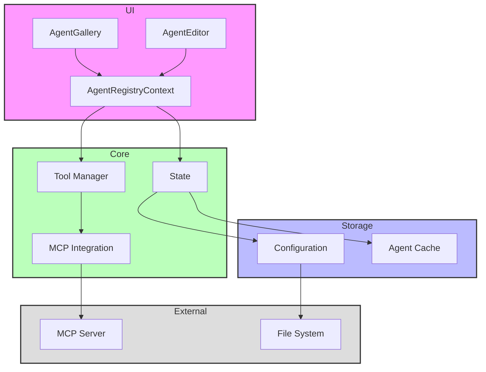

# Agent Registry Feature

## Overview

The Agent Registry is a core feature that manages and coordinates AI agents within the system. It provides functionality for storing, retrieving, and managing agent configurations, as well as handling the active agent state and associated tools.

## Directory Structure

```
📁 agent-registry/
├── 📁 __llm__/
│   └── 📄 README.md
├── 📁 contexts/
│   └── 📄 AgentRegistryContext.tsx
├── 📁 lib/
│   └── 📄 types.ts
└── 📄 index.tsx
```

## Architecture



## File Structure Documentation

```
📁 agent-registry/
├── 📄 index.tsx                 # Main entry point and exports
│   Last modified: 2024-01-08
│   Primary maintainer: Team
│   Dependencies: React, contexts/*
├── 📁 contexts/
│   └── 📄 AgentRegistryContext.tsx  # Core state management
│       Last modified: 2024-01-08
│       Primary maintainer: Team
│       Dependencies: React, lib/types
├── 📁 lib/
│   └── 📄 types.ts                  # Type definitions
│       Last modified: 2024-01-08
│       Primary maintainer: Team
│       Dependencies: None
└── 📁 __llm__/
    └── 📄 README.md                 # Feature documentation
        Last modified: 2024-01-08
        Primary maintainer: Team
        Dependencies: None
```

## Key Components

### AgentRegistryContext

A React context that provides agent management functionality throughout the application. It includes:

- Agent state management
- Tool management
- Configuration handling
- Active agent selection

### Types

Located in `lib/types.ts`, defines the core interfaces:

- `AgentConfig`: Configuration for individual agents
- `PromptPost`: Structure for agent prompts
- `AgentRegistryContextType`: Context interface

## Features

### Agent Management

- Load agents from configuration
- Save new agent configurations
- Delete existing agents
- Set and manage active agent
- Retrieve agent details

### Tool Integration

- Dynamic tool management with MCP (Model Context Protocol)
- Tool state synchronization
- Gemini format tool mapping

### Configuration

Default configuration includes:

- Model: "models/gemini-2.0-flash-exp"
- Audio response capabilities
- Voice configuration (default: "Kore")

## Usage

### Provider Setup

```tsx
import { AgentRegistryProvider } from "./features/agent-registry";

function App() {
  return (
    <AgentRegistryProvider>{/* Your app components */}</AgentRegistryProvider>
  );
}
```

### Using the Hook

```tsx
import { useAgentRegistry } from "./features/agent-registry";

function YourComponent() {
  const { agents, activeAgent, saveAgent, deleteAgent, setActiveAgent, tools } =
    useAgentRegistry();

  // Use the context values and functions
}
```

## Integration Points

- Integrates with MCP for tool management
- Works with Gemini model for responses
- Handles audio modality configurations
- Manages system instructions and prompts

## Dependencies

- React (Context, Hooks)
- MCP SDK
- Configuration utilities
- Gemini model integration
