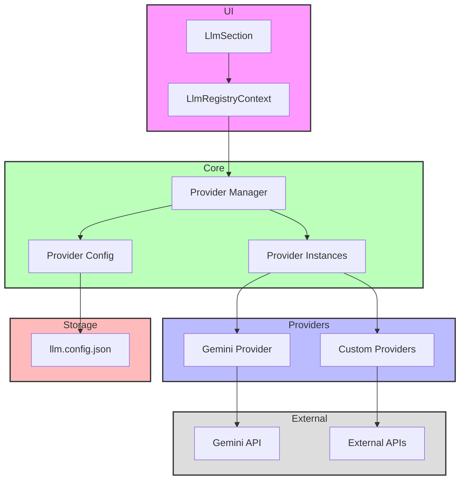

# LLM Registry

The LLM Registry is a central system for managing Language Model providers in the application. It provides a flexible and extensible way to integrate different LLM providers while maintaining a consistent interface.

## Directory Structure

```
📁 llm-registry/
├── 📁 __llm__/
│   └── 📄 README.md
├── 📁 components/
│   └── 📄 LlmSection.tsx
├── 📁 contexts/
│   └── 📄 LlmRegistryContext.tsx
├── 📁 lib/
│   ├── 📄 types.ts
│   └── 📄 config.ts
└── 📄 index.tsx
```

## Architecture



## File Structure Documentation

```
📁 llm-registry/
├── 📄 index.tsx                 # Main entry point and exports
│   Last modified: 2024-01-07
│   Primary maintainer: Team
│   Dependencies: React, contexts/*, components/*
├── 📁 components/
│   └── 📄 LlmSection.tsx       # UI component for LLM configuration
│       Last modified: 2024-01-07
│       Primary maintainer: Team
│       Dependencies: React, contexts/LlmRegistryContext
├── 📁 contexts/
│   └── 📄 LlmRegistryContext.tsx  # Core state and provider management
│       Last modified: 2024-01-07
│       Primary maintainer: Team
│       Dependencies: React, lib/*
├── 📁 lib/
│   ├── 📄 types.ts             # Type definitions
│   │   Last modified: 2024-01-07
│   │   Primary maintainer: Team
│   │   Dependencies: None
│   └── 📄 config.ts            # Configuration management
│       Last modified: 2024-01-07
│       Primary maintainer: Team
│       Dependencies: types.ts
└── 📁 __llm__/
    └── 📄 README.md            # Feature documentation
        Last modified: 2024-01-08
        Primary maintainer: Team
        Dependencies: None
```

## Configuration

LLM providers are configured through `config/llm.json`. This file specifies both the active provider and its settings:

```json
{
  "provider": "gemini",
  "config": {
    "apiKey": "your-api-key",
    "model": "gemini-pro",
    "temperature": 0.7,
    "maxTokens": 1000
  }
}
```

The configuration is loaded on application startup and cannot be changed at runtime through the UI. This ensures consistent behavior and security of sensitive information like API keys.

## Core Components

1. **LlmRegistryContext** (`contexts/LlmRegistryContext.tsx`)

   - Loads and maintains provider configuration from `config/llm.json`
   - Manages provider registration and instance lifecycle
   - Provides global access to the active provider

2. **Types** (`lib/types.ts`)

   - `LlmProviderConfig`: Provider metadata and configuration schema
   - `LlmProviderInstance`: Runtime instance of a provider with execution capabilities
   - `LlmRegistryContextType`: Context API interface
   - `LlmProviderSettings`: Configuration storage format

3. **Configuration** (`lib/config.ts`)
   - Handles loading settings from `config/llm.json`
   - Provides type-safe configuration management

## Provider Implementation

To implement a new LLM provider:

1. Define the provider configuration:

```typescript
const myProvider: LlmProviderConfig = {
  id: "unique-id",
  name: "Provider Name",
  description: "Provider Description",
  configSchema: {
    apiKey: {
      type: "string",
      label: "API Key",
      description: "Your API key",
      isSecret: true,
    },
    model: {
      type: "select",
      label: "Model",
      description: "The model to use",
      options: [
        { label: "Model A", value: "model-a" },
        { label: "Model B", value: "model-b" },
      ],
    },
  },
};
```

2. Create a provider hook:

```typescript
function useMyProvider() {
  const { registerProvider, unregisterProvider } = useLlmRegistry();

  const instance: LlmProviderInstance = {
    id: myProvider.id,
    name: myProvider.name,
    executePrompt: async (prompt) => {
      // Implementation
    },
    isLoading: false,
    error: null,
  };

  useEffect(() => {
    registerProvider(myProvider, instance);
    return () => unregisterProvider(myProvider.id);
  }, []);

  return instance;
}
```

## Usage

1. Configure your provider in `config/llm.json`:

```json
{
  "provider": "my-provider",
  "config": {
    "apiKey": "xxx",
    "model": "model-a"
  }
}
```

2. Wrap your application with the provider:

```typescript
<LlmRegistryProvider>
  <App />
</LlmRegistryProvider>
```

3. Use the global LLM context in components:

```typescript
function MyComponent() {
  const { executePrompt, isLoading, error } = useGlobalLlm();

  const handlePrompt = async () => {
    const response = await executePrompt({
      name: "my-prompt",
      messages: [
        /* ... */
      ],
    });
  };
}
```

## Current Providers

### Gemini

Google's Gemini language model with the following features:

- **Models**:
  - `gemini-pro`: Text generation and analysis
  - `gemini-pro-vision`: Multimodal capabilities (text + images)
- **Configuration**:
  - `apiKey`: Google API key (required)
  - `model`: Model selection
  - `temperature`: Output randomness (0.0 - 1.0)
  - `maxTokens`: Maximum response length

## Security Considerations

1. **API Keys**: Store sensitive information like API keys securely in `config/llm.json`. This file should be:

   - Added to `.gitignore`
   - Protected with appropriate file permissions
   - Never exposed through the UI

2. **Provider Validation**: The registry validates provider configurations at startup to ensure:
   - Required fields are present
   - Values match expected types and ranges
   - API keys are properly formatted

## Best Practices

1. **Configuration Management**:

   - Use environment variables for sensitive data in production
   - Maintain separate configurations for development/staging/production
   - Document all configuration options

2. **Error Handling**:

   - Implement proper error boundaries around LLM operations
   - Provide meaningful error messages
   - Handle rate limiting and quota exceeded scenarios

3. **Performance**:
   - Cache provider instances appropriately
   - Implement request debouncing where appropriate
   - Monitor token usage and costs
