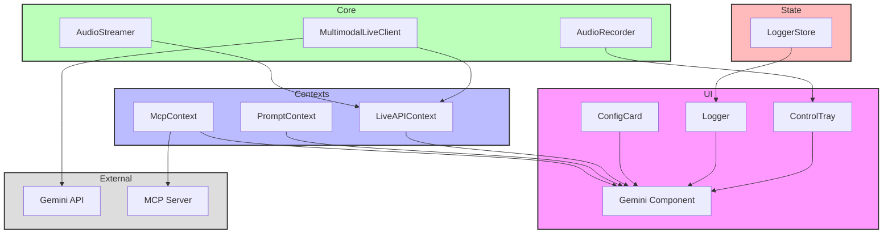

# Multimodal Agent Feature

## Overview

The Multimodal Agent is a sophisticated React-based feature that enables real-time interaction with AI models through multiple modalities including text, audio, and potentially images. It integrates with Google's Generative AI services and supports extensible tool-based interactions through a Model Context Protocol (MCP).

## Architecture



## Key Components

### UI Components

- **Gemini**: Main container component orchestrating the multimodal interaction
- **ControlTray**: Controls for audio recording and interaction management
- **Logger**: Real-time activity and message logging interface
- **ConfigCard**: Configuration display and management interface

### Context Providers

- **LiveAPIContext**: Manages connection to Gemini's real-time API
- **PromptContext**: Handles prompt configuration and state
- **McpContext**: Manages Model Context Protocol connections and tools

### Core Services

- **MultimodalLiveClient**: WebSocket-based client for real-time communication
- **AudioStreamer**: Handles audio streaming and processing
- **AudioRecorder**: Manages audio recording capabilities

### State Management

- **LoggerStore**: Zustand-based store for managing logging state

## Features

- Real-time audio streaming and processing
- Tool-based interaction system
- Configurable voice and response modalities
- Extensible MCP server integration
- Real-time activity logging
- Dynamic tool discovery and execution

## Technical Details

### Configuration

The feature supports various configuration options through the `LiveConfig` type:

- Model selection
- System instructions
- Generation configuration
- Tool configuration
- Voice configuration

### Tools System

Supports three types of tools:

1. Built-in tools (Google Search, Code Execution)
2. Function-based tools
3. MCP server tools

### Audio Processing

- Uses Web Audio API for recording and streaming
- Implements custom audio worklets for volume metering
- Supports real-time audio processing

## Usage

### Basic Setup

```typescript
import { LiveAPIProvider, McpProvider, PromptProvider } from "./contexts";
import Gemini from "./Index";

function App() {
  return (
    <LiveAPIProvider>
      <McpProvider>
        <PromptProvider>
          <Gemini />
        </PromptProvider>
      </McpProvider>
    </LiveAPIProvider>
  );
}
```

### Configuring Tools

Tools can be configured through the MCP context or directly in the prompt configuration:

```typescript
const config = {
  tools: [
    { googleSearch: {} },
    {
      functionDeclarations: [
        {
          name: "customTool",
          description: "Custom tool description",
          parameters: {
            type: "object",
            properties: {
              // ... parameter definitions
            },
          },
        },
      ],
    },
  ],
};
```

## Development

### Prerequisites

- Node.js 16+
- Google Generative AI API key
- MCP server (optional)

### Environment Variables

Required environment variables:

- `VITE_GEMINI_API_KEY`: Google Generative AI API key

### Testing

The feature includes unit tests for core functionality. Run tests with:

```bash
npm test
```
