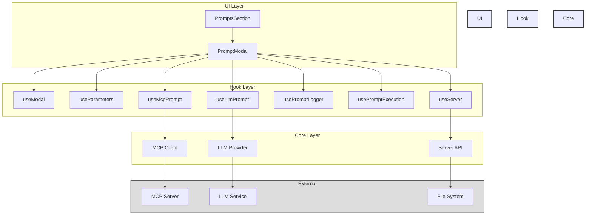
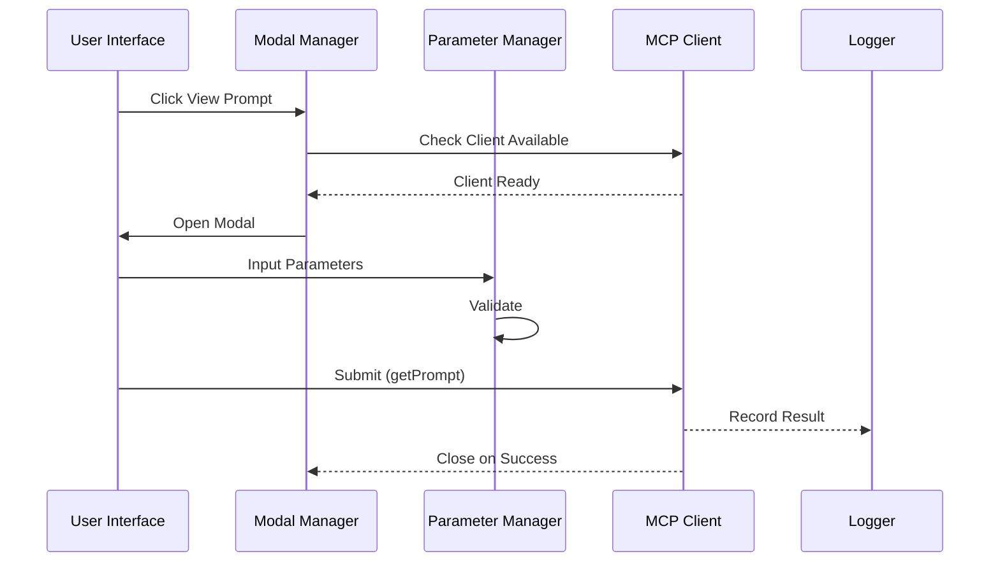
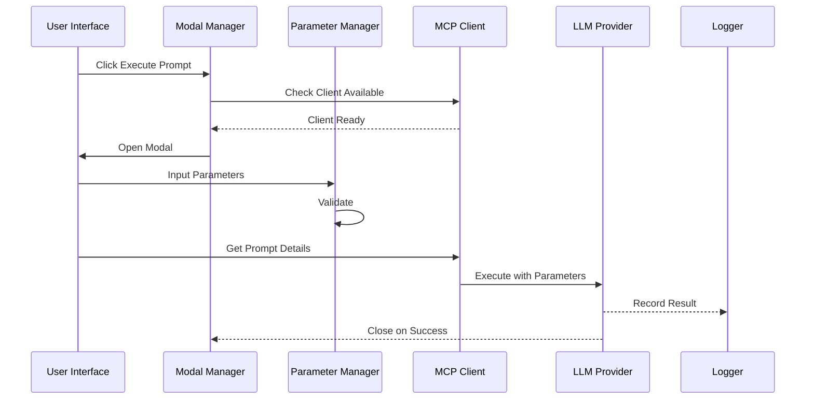

# Server Features

## Overview

The Server feature manages server-side operations, prompt execution, and interactions with the MCP (Model Context Protocol) client. It provides a robust architecture for handling prompts, parameters, and execution flows.

## Directory Structure

```
📁 server/
├── 📁 __llm__/
│   └── 📄 README.md
├── 📁 api/
│   └── 📄 config.ts
├── 📁 components/
│   ├── 📄 PromptsSection.tsx
│   └── 📄 PromptModal.tsx
├── 📁 hooks/
│   ├── 📄 useModal.ts
│   ├── 📄 useParameters.ts
│   ├── 📄 useMcpPrompt.ts
│   ├── 📄 useLlmPrompt.ts
│   ├── 📄 usePromptLogger.ts
│   ├── 📄 usePromptExecution.ts
│   └── 📄 useServer.ts
└── 📁 utils/
    └── 📄 validation.ts
```

## File Structure Documentation

```
📁 server/
├── 📄 api/config.ts            # Server configuration
│   Last modified: 2024-01-07
│   Primary maintainer: Team
│   Dependencies: fs, path
├── 📁 components/
│   ├── 📄 PromptsSection.tsx  # Main prompts UI container
│   │   Last modified: 2024-01-07
│   │   Primary maintainer: Team
│   │   Dependencies: React, hooks/*
│   └── 📄 PromptModal.tsx     # Prompt execution modal
│       Last modified: 2024-01-07
│       Primary maintainer: Team
│       Dependencies: React, hooks/*
├── 📁 hooks/
│   ├── 📄 useModal.ts         # Modal state management
│   │   Last modified: 2024-01-07
│   │   Primary maintainer: Team
│   │   Dependencies: React
│   ├── 📄 useParameters.ts    # Parameter management
│   │   Last modified: 2024-01-07
│   │   Primary maintainer: Team
│   │   Dependencies: React, utils/validation
│   ├── 📄 useMcpPrompt.ts     # MCP client operations
│   │   Last modified: 2024-01-07
│   │   Primary maintainer: Team
│   │   Dependencies: React, MCP SDK
│   ├── 📄 useLlmPrompt.ts     # LLM operations
│   │   Last modified: 2024-01-07
│   │   Primary maintainer: Team
│   │   Dependencies: React, llm-registry
│   ├── 📄 usePromptLogger.ts  # Operation logging
│   │   Last modified: 2024-01-07
│   │   Primary maintainer: Team
│   │   Dependencies: React
│   ├── 📄 usePromptExecution.ts # Prompt execution flow
│   │   Last modified: 2024-01-07
│   │   Primary maintainer: Team
│   │   Dependencies: React, hooks/*
│   └── 📄 useServer.ts        # Server state management
│       Last modified: 2024-01-07
│       Primary maintainer: Team
│       Dependencies: React, api/config
└── 📁 utils/
    └── 📄 validation.ts       # Parameter validation
        Last modified: 2024-01-07
        Primary maintainer: Team
        Dependencies: None
```

## Architecture



## Core Concepts

### Hooks Architecture

1. `useModal` - Modal State Management

   - Opens/closes modal
   - Manages modal mode (view/execute)
   - Handles modal actions

2. `useParameters` - Parameter Management

   - Manages parameter values
   - Handles validation
   - Provides parameter update methods

3. `useMcpPrompt` - MCP Operations

   - Handles MCP client availability
   - Fetches prompt details
   - Executes MCP operations
   - Manages connection status (connected/pending/disconnected)

4. `useLlmPrompt` - LLM Operations

   - Manages LLM provider
   - Executes prompts via LLM
   - Handles LLM responses
   - Validates message availability

5. `usePromptLogger` - Logging

   - Records operations
   - Manages execution history
   - Provides logging utilities
   - Supports success/error logging

6. `usePromptExecution` - Prompt Execution Management

   - Manages prompt selection state
   - Handles parameter validation
   - Controls execution flow
   - Provides error handling

7. `useServer` - Server Management
   - Manages server connection state
   - Handles server capabilities
   - Provides unified server interface
   - Manages prompt and resource operations

### Flow Diagrams

#### View Prompt Flow



#### Execute Prompt Flow



## Implementation Details

### State Management

Each hook maintains its own isolated state:

- Modal: `isOpen`, `mode`
- Parameters: `values`, `errors`
- MCP: `client`, `status`
- LLM: `provider`, `status`
- Logger: `history`, `operations`

### Error Handling

1. Client Availability

   ```typescript
   if (!clientState?.client) {
     throw new Error("No MCP client available");
   }
   ```

2. Parameter Validation

   ```typescript
   const errors: ValidationError[] = [];
   if (!selectedPrompt?.inputSchema) return errors;

   const { required = [] } = selectedPrompt.inputSchema;
   required.forEach((key) => {
     if (!promptParams[key] || promptParams[key].trim() === "") {
       errors.push({
         path: [key],
         message: `${key} is required`,
       });
     }
   });
   ```

3. Operation Results
   ```typescript
   try {
     const result = await onExecutePrompt(selectedPrompt.name, promptParams);
     addLog({
       type: "prompt",
       operation: "Execute Prompt",
       status: "success",
       name: selectedPrompt.name,
       params: promptParams,
       result,
     });
   } catch (error) {
     addLog({
       type: "prompt",
       operation: "Execute Prompt",
       status: "error",
       name: selectedPrompt.name,
       params: promptParams,
       error: error instanceof Error ? error.message : "An error occurred",
     });
   }
   ```

### Testing Strategy

1. Unit Tests

   - Individual hook behavior
   - Parameter validation
   - Error handling

2. Integration Tests

   - Hook interactions
   - Flow completion
   - Error propagation

3. E2E Tests
   - Complete view flow
   - Complete execute flow
   - Error scenarios

## Usage Example

```typescript
// Example of hook composition in PromptsSection
function PromptsSection({ onExecutePrompt, onGetPromptDetails }) {
  // Core hooks
  const modal = useModal();
  const params = useParameters();

  // Composed hooks
  const promptExecution = usePromptExecution({
    onExecutePrompt,
    onGetPromptDetails,
  });

  const handleSubmit = async () => {
    if (!params.validate(selectedPrompt?.inputSchema)) {
      return;
    }

    const success = await promptExecution.executePrompt();
    if (success) {
      modal.close();
      params.reset();
    }
  };

  return (
    <PromptModal
      isOpen={modal.isOpen}
      onClose={() => {
        modal.close();
        params.reset();
      }}
      onSubmit={handleSubmit}
      parameters={params.values}
      errors={params.errors}
      onChange={params.update}
    />
  );
}
```
